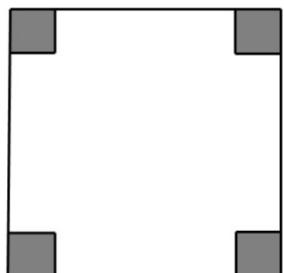

<!-- question-source:start -->
【变式3】已知 $a$ 、 $b$ 、 $c$ 、 $d$ 为正实数，利用平均不等式证明（1）（2）并指出等号成立条件，然后解

(3) 中的实际问题.

(1)请根据基本不等式 $a + b = 2\sqrt{ab}\left(a,b\in \mathbf{R}^{+}\right)$ ，证明： $\frac{a + b + c + d}{4}\sqrt[4]{a\cdot b\cdot c\cdot d}$

(2)请利用（1）的结论，证明： $\frac{a+b+c}{3}\sqrt[3]{a\cdot b\cdot c}$ ；

(3)如图，将边长为0.5米的正方形硬纸板，在它的四个角各减去一个小正方形后，折成一个无盖纸盒．如果

要使制作的盒子容积最大，那么剪去的小正方形的边长应为多少米？

<!-- question-source:end -->

![[高中/课堂同步/题库/人教A版高中数学同步讲义(2026)/01_必修第一册/第二章 一元二次函数、方程和不等式/第二章 一元二次函数、方程和不等式（高效培优讲义）/题型08_不等式与实际问题的关联/questions/answers/Q00078983A1.md]]
