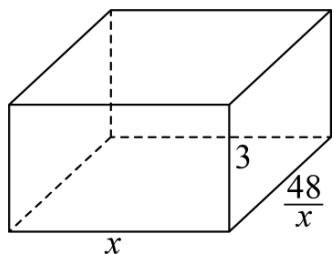

> [!faq]- 《第二章 一元二次函数、方程和不等式（高效培优讲义）》官方解析
>
> > [!success]- **【答案】** 63400
>
> > [!note]- **【解析】**
> > 设房屋底面一边长为 $x(x > 0)\mathrm{m}$ ，则另一边长为 $\frac{48}{x}\mathrm{m}$
> >
> > 所以房屋的总造价为 $y = 3x \times 1200 + 3 \times \frac{48}{x} \times 800 \times 2 + 5800$
> >
> > 因为 x > 0 ，所以 $y = 2\sqrt{3x \times 1200 \times \frac{48}{x} \times 800 \times 6} + 5800 = 57600 + 5800 = 63400$
> >
> > 当且仅当 $3x \times 1200 = 3 \times \frac{48}{x} \times 800 \times 2$ 即 $x = 8$ 时等号成立.
> >
> > 
> >
> > 故答案为：63400.
> >
> > ## 方法技巧
> >
> > (1)设变量时一般要把求最大值或最小值的变量定义为函数.
> >
> > (2)根据实际问题抽象出函数的解析式后，只需利用基本不等式求得函数的最值.
> >
> > (3)在求函数的最值时，一定要在定义域(使实际问题有意义的自变量的取值范围)内求解.
