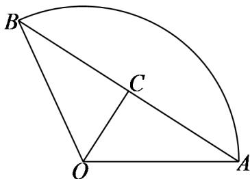

> [!faq]- 《专题01 任意角和弧度制的两大常考题型（高效培优专项训练）数学人教A版2019高一必修第一册》官方解析
>
> > [!success]- **【答案】** C
>
> > [!note]- **【解析】**
> > 设扇形的半径为 $r$ ，可得出扇形的弧长为 $l = 4 - 2r(0 < r < 2)$
> >
> > 所以，扇形的面积为 $S = \frac{1}{2} lr = \frac{1}{2} r(4 - 2r) = -r^2 + 2r = -(r - 1)^2 + 1$
> >
> > 当 $r = 1$ 时，该扇形的面积取到最大值1，扇形的弧长为 $l = 4 - 2r = 2$ ，此时 $\angle AOB = \frac{l}{r} = 2$ 如下图所示：
> >
> > 
> >
> > 取 $AB$ 的中点 $C$ ，则 $OC \perp AB$ ，且 $\angle AOC = 1$ ，因此， $AB = 2AC = 2r\sin 1 = 2\sin 1$ .
> >
> > 故选 **C**.
