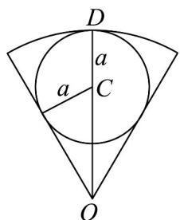
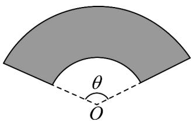

> [!faq]- 《专题01 任意角和弧度制的两大常考题型（高效培优专项训练）数学人教A版2019高一必修第一册》官方解析
>
> > [!success]- **【答案】** $2\pi$
>
> > [!note]- **【解析】**
> > 设扇形所在圆半径为 $r$ ， $\therefore \frac{1}{2}\cdot \frac{\pi}{3} r^2 = \frac{3\pi}{2},\therefore r = 3$
> >
> > 
> >
> > 如图：设割出的圆半径为 $a$ ，圆心为 $C$ ， $\therefore \left|CO\right| = \frac{a}{\sin \frac{\pi}{6}} = 2a$
> >
> > $r = 3 = |CO| + |DC| = 3a$ ，故 $a = 1$
> >
> > 所以最大的圆周长为 $2\pi$
> >
> > 故答案为： $2\pi$
> >
> > 26. 立德中学拟建一个扇环形状的花坛（如图），该扇环面由以点 $O$ 为圆心的两个同心圆弧和延长后可通过点 $O$ 的两条直线段围成·按设计要求扇环的周长为 $30$ 米，其中大圆环所在圆的半径为 $10$ 米，设计小圆环所在圆的半径为 $x$ 米，圆心角为 $\theta$ （弧度），当 $\theta = \frac{4}{3}$ 时， $x =$ \_\_\_\_米；现要给花坛的边缘（实线部分）进行装饰，已知直线部分的装饰费用为 $4$ 元/米，弧线部分的装饰费用为 $9$ 元/米，则花坛每平方米的装饰费用 $M$ 的最小值为 \_\_\_\_元（ $M = \frac{\text{总费用}}{\text{花坛总面积}}$ ）。
> >
> > 
> >
> > 【答案】 $\frac{10}{3}/3\frac{1}{3}$
> >
> > 【详解】由题意可得， $30 = x\theta + 10\theta + 2(10 - x)$ ，解得 $\theta = \frac{10 + 2x}{10 + x}$ ，
> >
> > 当 $\theta=\frac{4}{3}$ 时，解得 x=5 ，
> >
> > $$
> > S _ {\text {花}} = \frac {1}{2} \times 1 0 \times \theta \times 1 0 - \frac {1}{2} \cdot \theta \cdot x ^ {2} = \frac {\theta}{2} (1 0 0 - x ^ {2}) = - x ^ {2} + 5 x + 5 0 (0 <   x <   1 0)
> > $$
> >
> > 装饰费为 $9\theta (x + 10) + 2(10 - x)\cdot 4 = 9x\theta +90\theta +8(10 - x) = 170 + 10x$
> >
> > 故 $M = \frac{170 + 10x}{-x^2 + 5x + 50} = -\frac{10(17 + x)}{x^2 - 5x - 50}$
> >
> > 令 $t = 17 + x$ ， $17 < t < 27$
> >
> > $$
> > M = - \frac {1 0 t}{(t - 1 7) ^ {2} - 5 (t - 1 7) - 5 0} = - \frac {1 0 t}{t ^ {2} - 3 9 t + 3 2 4} = - \frac {1 0}{t - 3 9 + \frac {3 2 4}{t}}
> > $$
> >
> > $\because t + \frac{324}{t} > 2\sqrt{t \cdot \frac{324}{t}} = 36$ ，当且仅当 $t = \frac{326}{t}$ ，即 $t = 18$ ，即 $x = 1$ 时，等号成立，
> >
> > ∴ M 的最小值为 $-\frac{10}{36-39}=\frac{10}{3}$ ，
> >
> > 花坛每平方米的装饰费用 $M$ 最小为 $\frac{10}{3}$ 元·
> >
> > 故答案为： $5$ ； $\frac{10}{3}$
