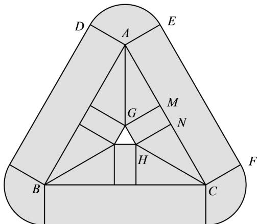
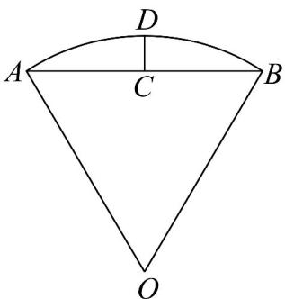
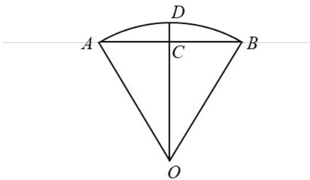
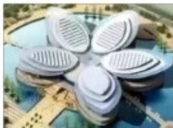
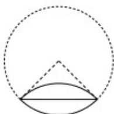
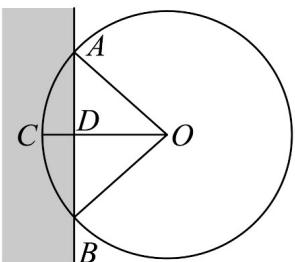
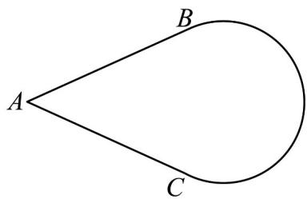
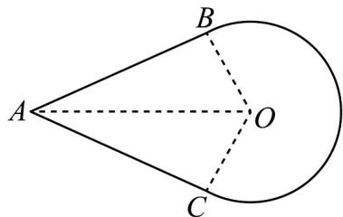
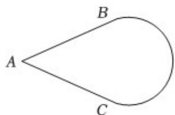
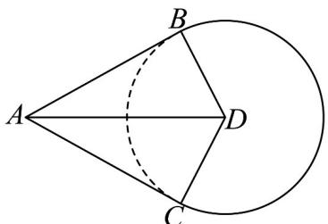

> [!faq]- 《专题01 任意角和弧度制的两大常考题型（高效培优专项训练）数学人教A版2019高一必修第一册》官方解析
>
> > [!success]- **【答案】** B
>
> > [!note]- **【解析】**
> > 由题意，点集 $D$ 所表示的图形如图，VABC是边长为 $^4$ 的正三角形，
> >
> > 
> >
> > 其中 $AE \perp AC$ ， $AD \perp AB$ ， $GM \perp AC$ ， $HN \perp AC$ ， $AD = AE = GM = HN = 1$ ， $\because \angle DAE = 2\pi - \pi - \frac{\pi}{3} = \frac{2\pi}{3}$ ， $AD = 1$ ，
> > 所以扇形 $ADE$ 的面积为 $S_{ADE} = \frac{1}{2} \times \frac{2\pi}{3} \times 1^2 = \frac{\pi}{3}$ ， $\because \angle GAM = \frac{\pi}{6}$ ， $GM = 1$ ， $\therefore AM = \sqrt{3}$ ，
> >
> > 所以 $\triangle AMG$ 的面积为 $S_{\triangle AMG} = \frac{1}{2} \times \sqrt{3} \times 1 = \frac{\sqrt{3}}{2}$
> >
> > 又 $MN = AC - 2AM = 4 - 2\sqrt{3}$
> >
> > 所以四边形 MNHG 的面积为 $S_{MNHG} = \left(4 - 2\sqrt{3}\right) \times 1 = 4 - 2\sqrt{3}$
> >
> > 又四边形 $AEFC$ 的面积为 $S_{AEFC} = 4 \times 1 = 4$
> >
> > 点集 $D = \{P \mid d(P, C) \leq 1\}$ 所表示的图形面积为：
> >
> > $$
> > S = 3 S _ {A D E} + 3 S _ {A E F C} + 3 S _ {M N H G} + 6 S _ {\triangle A M G} = \pi + 1 2 + 1 2 - 6 \sqrt {3} + 3 \sqrt {3} = 2 4 - 3 \sqrt {3} + \pi .
> > $$
> >
> > 故选：B.
> >
> > 12. 沈括的《梦溪笔谈》是中国古代科技史上的杰作，其中收录了计算圆弧长度的“会圆术”，如图，AB 是以 O 为圆心，OA 为半径的圆弧，C 是 AB 的中点，D 在 AB 上， $CD \perp AB$ 。“会圆术”给出 AB 的弧长的近似值 s 的计算公式： $s = AB + \frac{CD^{2}}{OA}$ ．当 $OA = 2, \angle AOB = 60^{\circ}$ 时， $_{S} = (\quad)$
> >
> > 
> >
> > A. $\frac{11 - 3\sqrt{3}}{2}$ B. $\frac{11 - 4\sqrt{3}}{2}$ C. $\frac{9 - 3\sqrt{3}}{2}$ D. $\frac{9 - 4\sqrt{3}}{2}$
> >
> > 【答案】B
> >
> > 【详解】解：如图，连接OC
> >
> > 因为 C 是 AB 的中点，
> >
> > 所以 $OC \perp AB$
> >
> > 又 $CD \perp AB$ ，所以 $O, C, D$ 三点共线，
> >
> > 即 $OD = OA = OB = 2$
> >
> > 又 $\angle AOB = 60^{\circ}$
> >
> > 所以 $AB = OA = OB = 2$
> >
> > 则 $OC = \sqrt{3}$ ，故 $CD = 2 - \sqrt{3}$
> >
> > 所以 $s = AB + \frac{CD^{2}}{OA} = 2 + \frac{\left(2 - \sqrt{3}\right)^{2}}{2} = \frac{11 - 4\sqrt{3}}{2}$ .
> >
> > 故选：B.
> >
> > 
> >
> > 13．砀山被誉为“酥梨之乡”，每逢四月，万树梨花开，游客八方来．如图 $^{1}$ ，梨花广场的标志性建筑就是根据梨花的形状进行设计的，建筑的五个“花瓣”中的每一个都可以近似看作由两个对称的弓形组成，图 $^{2}$ 为其中的一个“花瓣”平面图，设弓形的圆弧所在圆的半径为R，弦长为 $\sqrt{2}R$ ，则一个“花瓣”的面积为（）
> >
> > 【答案】
> >
> > 
> > 图1
> >
> > 
> > 图2
> >
> > A. $\frac{\pi - 1}{2} R^2$ B. $\frac{\pi - 2}{2} R^2$ C. $\frac{\pi - 1}{4} R^2$ D. $(\pi - 1)R^2$
> >
> > 【答案】B
> >
> > 【详解】因为弓形的圆弧所在圆的半径为 R，弦长为 $\sqrt{2}R$ ，
> > 所以弓形的圆弧所对的圆心角的大小为 $\frac{\pi}{2}$ ，
> >
> > 所以弓形的面积 $S = \frac{1}{4} \times \pi R^2 - \frac{1}{2} R^2$
> >
> > 所以一个“花瓣”的面积为 $\frac{\pi - 2}{2} R^2$
> >
> > 故选：B.
> >
> > 14. 我国古代数学经典著作《九章算术》中记载了一个“圆材埋壁”的问题：“今有圆材埋在壁中，不知大小，以锯锯之，深一寸，锯道长一尺，问径几何？”现有一类似问题，不确定大小的圆柱形木材，部分埋在墙壁中，其截面如图所示。用锯去锯这木材，若锯口深 $CD = \sqrt{2} - 1$ ，锯道 $AB = 2$ ，则图中 $ACB$ 的长度为（）
> >
> > 【答案】
> >
> > 
> >
> > A. $\frac{\pi}{2}$ B. $\frac{\sqrt{2}}{2}\pi$ C. $\pi$ D. $\sqrt{2}\pi$
> >
> > 【答案】B
> >
> > 【详解】设圆的半径为 $r$ ，则 $OD = r - CD = r - (\sqrt{2} - 1)$ ， $AD = \frac{1}{2} AB = 1$ ，由勾股定理可得 $OD^2 + AD^2 = OA^2$ ，即 $\left[r - (\sqrt{2} - 1)\right]^2 + 1 = r^2$ ，解得 $r = \sqrt{2}$ ，所以， $OA = OB = \sqrt{2}$ ， $AB = 2$ ，所以， $OA^2 + OB^2 = AB^2$ ，故 $\angle AOB = \frac{\pi}{2}$ ，因此， $\overrightarrow{ACB} = \frac{\pi}{2} \times \sqrt{2} = \frac{\sqrt{2}}{2}\pi$ 。
> >
> > 故选：B.
> >
> > 15. 水滴是刘慈欣的科幻小说《三体Ⅱ·黑暗森林》中提到的由三体文明使用强互作用力（SIM）材料所制成的宇宙探测器，因为其外形与水滴相似，所以被人类称为水滴·如图所示，水滴是由线段 $AB, AC$ 和圆的优弧 $BC$ 围成，其中 $AB, AC$ 恰好与圆弧相切·若圆弧所在圆的半径为 1，点 A 到圆弧所在圆圆心的距离为 2，则该封闭图形的面积为（）
> >
> > 【答案】
> >
> > 
> >
> > A. $\sqrt{3} +\frac{2\pi}{3}$ B. $2\sqrt{3} +\frac{2\pi}{3}$ C. $2\sqrt{3} +\frac{\pi}{3}$ D. $\sqrt{3} +\frac{\pi}{3}$
> >
> > 【答案】A
> >
> > 【详解】如图，
> >
> > 
> >
> > 设圆弧所在圆的圆心为 $O$ ，连接 $OA,OB,OC$ ，依题意得 $OB\bot AB,OC\bot AC$
> >
> > 且 $OB = OC = 1, OA = 2$ ，则 $AB = AC = \sqrt{3}, \angle BAC = \frac{\pi}{3}$ ，
> >
> > 所以 $\angle BOC = \frac{2\pi}{3}$
> >
> > 所以该封闭图形的面积为 $2 \times \frac{1}{2} \times \sqrt{3} \times 1 + \frac{1}{2} \times \left(2\pi - \frac{2\pi}{3}\right) \times 1^2 = \sqrt{3} + \frac{2\pi}{3}$ .
> >
> > 故选：A.
> >
> > 16. 水滴是刘慈欣的科幻小说《三体II》中提到的由三体文明使用强互作用力（SIM）材料所制成的宇宙探测器，因为其外形与水滴相似，所以被人类称为水滴。如图所示，水滴是由线段 $AB$ ， $AC$ 和圆的优弧 $BC$ 围成，其中 $AB$ ， $AC$ 恰好与圆弧相切。若圆弧所在圆的半径为 $2$ ，点 A 到圆弧所在圆圆心的距离为 $4$ ，则该封闭图形的面积为 \_\_\_\_。
> >
> > 【答案】
> >
> > 
> >
> > 【答案】 $4\sqrt{3}+\frac{8\pi}{3}$ ;
> >
> > 【详解】取优弧 BC 所在圆的圆心 D，连接 AD，BD, CD，则 $BD \perp AB$ ， $CD \perp AC$
> >
> > 则 $AD = 4, BD = CD = 2$ ，所以 $\angle BAD = \angle CAD = \frac{\pi}{6}$ ，则 $\angle BDC = \frac{2}{3}\pi$
> >
> > $$
> > A B = A C = \sqrt {4 ^ {2} - 2 ^ {2}} = 2 \sqrt {3}
> > $$
> >
> > 故优弧 $BC$ 对应的圆心角为 $\frac{4}{3}\pi$ ，对应的扇形面积为 $\frac{1}{2} \times \frac{4}{3}\pi \times 2^2 = \frac{8}{3}\pi$
> >
> > 而 $S_{\triangle ABD} = S_{\triangle ACD} = \frac{1}{2}\times 2\sqrt{3}\times 2 = 2\sqrt{3}$
> >
> > 所以该封闭图形的面积为 $\frac{8}{3}\pi + S_{\triangle ABD} + S_{\triangle ACD} = \frac{8}{3}\pi + 4\sqrt{3}$ .
> >
> > 
> >
> > 故答案为： $4\sqrt{3}+\frac{8\pi}{3}$
