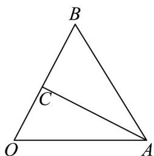
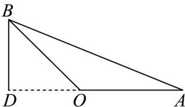
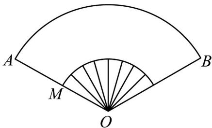
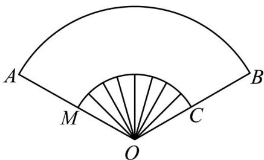

> [!faq]- 《专题01 任意角和弧度制的两大常考题型（高效培优专项训练）数学人教A版2019高一必修第一册》官方解析
>
> > [!success]- **【答案】** $\frac{\pi}{3}$ 或 $\frac{5\pi}{3}$ 或 $\frac{7\pi}{3}$ 或 $\frac{11\pi}{3}$
>
> > [!note]- **【解析】**
> > 当VAOB是锐角三角形时，过A作 $AC \perp OB$ ，垂足为C
> >
> > 所以有 $AC = OA \cdot \sin \angle AOB = 2 \sin \angle AOB$
> >
> > 
> >
> > 因为 VAOB 的面积为 1，
> >
> > 所以 $\frac{1}{2} \times 2 \times 2 \sin \angle AOB = 1$ ，解得 $\sin \angle AOB = \frac{1}{2}$ ，
> >
> > 扇形 $AOB$ 的圆心角是 $\frac{\pi}{6}$ 或 $\frac{11\pi}{6}$
> >
> > 扇形的面积分别为 $S=\frac{1}{2}\times\frac{\pi}{6}\times2^{2}=\frac{\pi}{3}$ 或 $S=\frac{1}{2}\times\frac{11\pi}{6}\times2^{2}=\frac{11\pi}{3}$ ;
> >
> > 当VAOB是钝角三角形时，过B作 $BD\perp OA$ ，垂足为D
> >
> > 所以有 $BD = OB \cdot \sin (\pi - \angle AOB) = 2\sin \angle AOB$ ，解得 $\sin \angle AOB = \frac{1}{2}$
> >
> > 
> >
> > 扇形 $AOB$ 的圆心角是 $\frac{5\pi}{6}$ 或 $\frac{7\pi}{6}$
> >
> > 扇形的面积分别为 $S = \frac{1}{2} \times \frac{5\pi}{6} \times 2^2 = \frac{5\pi}{3}$ 或 $S = \frac{1}{2} \times \frac{7\pi}{6} \times 2^2 = \frac{7\pi}{3}$ ;
> >
> > 故答案为： $\frac{\pi}{3}$ 或 $\frac{5\pi}{3}$ 或 $\frac{7\pi}{3}$ 或 $\frac{11\pi}{3}$
> >
> > 20．“数摺聚清风，一捻生秋意”是宋朝朱翌描写折扇的诗句，折扇出入怀袖，扇面书画，扇骨雕琢，是文人雅士的宠物，所以又有“怀袖雅物”的别号．如图是折扇的示意图，其中 $OA = 20\mathrm{cm}$ ， $\angle AOB = 120^{\circ}$ ， $M$ 为 $OA$ 的中点，则扇面（图中扇环）部分的面积是\_\_\_\_ $\mathrm{cm}^2$ ：
> >
> > 
> >
> > 【答案】 $100\pi$
> >
> > 【详解】设线段 BO 的中点为 C，则 $S_{扇环ABCM}=S_{扇形AOB}-S_{扇形OMC}=\frac{1}{2}\times\frac{2\pi}{3}\left[20^{2}-\left(\frac{20}{2}\right)^{2}\right]=100\pi$ $cm^{2}$
> >
> > 
> >
> > 故答案为： $100\pi$
