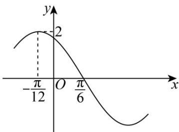

<!-- question-source:start -->
9. 已知函数 $f(x) = A \sin (\omega x + \varphi) (A > 0, \omega > 0, 0 < \varphi < \pi)$ 的部分图象如图所示.

(1)求 $f(x)$ 的解析式；

(2)求 $f(x)$ 在 $[0,\pi ]$ 上的单调增区间；

(3)若 $f\left(\frac{\alpha}{2}\right) = \frac{4}{3}$ ，求 $\sin^2\left(\alpha +\frac{\pi}{6}\right) + \sin \left(\alpha -\frac{\pi}{3}\right)$ 的值.
<!-- question-source:end -->

![[高中/课堂同步/题库/人教A版高中数学同步讲义(2026)/01_必修第一册/第五章 三角函数/专题03正弦函数、余弦函数的图像与性质的五大常考题型（高效培优专项训练）数学人教A版2019高一必修第一册/题型一_正弦函数_余弦函数的图像/questions/answers/Q00076085A1.md]]
