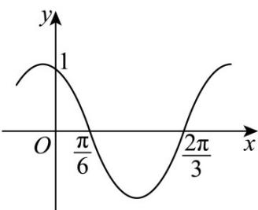

> [!faq]- 《专题03正弦函数、余弦函数的图像与性质的五大常考题型（高效培优专项训练）数学人教A版2019高一必修第一册》官方解析
>
> > [!success]- **【答案】**  A. $\cos \left(2x + \frac{\pi}{6}\right)$ B. $\sin \left(2x - \frac{\pi}{3}\right)$ C. $\sin \left(x + \frac{\pi}{3}\right)$ D. $\cos \left(\frac{5\pi}{6} - 2x\right)$
>
> > [!note]- **【解析】**
> > 由图象可得 $\frac{T}{2} = \frac{2\pi}{3} -\frac{\pi}{6} = \frac{\pi}{2}$ ，解得 $T = \pi$
> >
> > 所以 $\frac{2\pi}{\omega} = \pi$ ，得 $\omega = 2$ ，所以 $y = \sin (2x + \varphi)$
> >
> > 由图象可得当 $x=\frac{\frac{\pi}{6}+\frac{2\pi}{3}}{2}=\frac{5\pi}{12}$ 时，y=-1，
> >
> > 所以 $\sin \left(\frac{5\pi}{6} +\varphi\right) = -1$ ，所以 $\frac{5\pi}{6} +\varphi = \frac{3\pi}{2} +2k\pi ,k\in \mathbb{Z}$
> >
> > 得 $\varphi=\frac{2\pi}{3}+2k\pi,k\in Z$
> >
> > 所以 $y = \sin \left(2x + \frac{2\pi}{3} + 2k\pi\right)(k \in \mathbb{Z})$
> >
> > $$
> > = \sin \left(2 x + \frac {2 \pi}{3}\right)
> > $$
> >
> > $$
> > = \sin \left(2 x + \frac {\pi}{2} + \frac {\pi}{6}\right)
> > $$
> >
> > $$
> > = \cos \left(2 x + \frac {\pi}{6}\right)
> > $$
> >
> > 故选：A
> >
> > 3. 函数 $f(x) = \sin \left( x + \frac{1}{x} \right)$ 在 $\left( \frac{1}{10}, 10 \right)$ 上的零点个数为（） A. 3 B. 4 C. 6 D. 8
> >
> > 【答案】C
> >
> > 【详解】令函数 $t = x + \frac{1}{x}$ ，根据“勾函数”的性质可知：函数 $t = x + \frac{1}{x}$ 在 $\left(\frac{1}{10}, 1\right]$ 上单调递减，在 $[1, 10)$ 上单调递增，
> >
> > 且 $t(1) = 2$ ， $t\left(\frac{1}{10}\right) = t(10) = 10.1$
> >
> > 所以当 $x \in \left(\frac{1}{10}, 10\right)$ 时， $t \in [2, 10.1)$ ，
> >
> > 由 $y = \sin t = 0\Rightarrow t = k\pi$ ， $k\in Z$
> >
> > 只有当 k=1,2,3 时，t 的值分别对应 $\pi,2\pi,3\pi\in[2,10.1)$ .
> >
> > 又因为 $x + \frac{1}{x} = \pi, 2\pi, 3\pi$ 在 $\left(\frac{1}{10}, 10\right)$ 上各有 $^2$ 个解，
> >
> > 所以 $f(x)$ 在 $\left(\frac{1}{10}, 10\right)$ 上有 $^6$ 个零点.
> >
> > 故选 **C**
