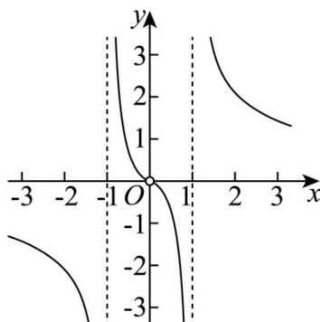
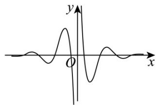
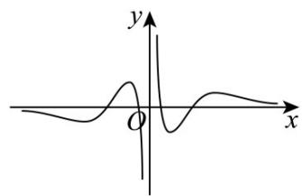
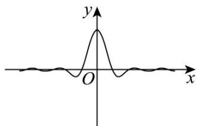
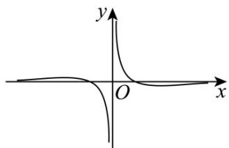
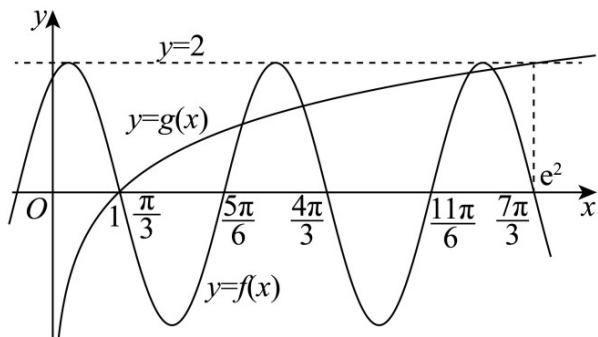

> [!faq]- 《专题03正弦函数、余弦函数的图像与性质的五大常考题型（高效培优专项训练）数学人教A版2019高一必修第一册》官方解析
>
> > [!success]- **【答案】**  A. $g(x) = 2^{x} + 2^{-x}$ B. $g(x) = 2^{x} - 2^{-x}$ C. $g(x) = x^2$ D. $g(x) = \ln x^2$
>
> > [!note]- **【解析】**
> > 由图可知 $f(x)$ 的定义域为 $\{x\mid x\neq \pm 1$ 且 $x\neq 0\}$
> >
> > 选项 A， $g(x)=2^{x}+2^{-x}$ ，则 $f(x)$ 的定义域是 R，故 A 错误；
> >
> > 选项 B， $g(x)=2^{x}-2^{-x}=0\Leftrightarrow x=0$ ，因此 $f(x)$ 的定义域是 $\left\{x\mid x\neq0\right\}$ ，故 B 错误；
> >
> > 选项 C， $g(x)=x^{2}=0\Rightarrow x=0$ ，因此 $f(x)$ 的定义域是 $\left\{x\mid x\neq0\right\}$ ，故 C 错误；
> >
> > 选项D，若 $g(x) = \ln x^2 = 2\ln |x|$ ，则 $f(x)$ 的定义域为 $\{x \mid x \neq \pm 1$ 且 $x \neq 0\}$ ，故D正确.
> >
> > 故选：D.
> >
> > 5. 函数 $f(x) = \frac{2\cos(\pi x)}{\mathrm{e}^x - \mathrm{e}^{-x}}$ 的图像大致为（）
> >
> > 【答案】
> >
> > A
> >
> > 
> >
> > B
> >
> > 
> >
> > C.
> >
> > 
> >
> > D
> >
> > 
> >
> > 【答案】A
> >
> > 【详解】解：由 $\mathrm{e}^x -\mathrm{e}^{-x}\neq 0$ ，解得 $x\neq 0$
> >
> > 所以函数 $f(x)$ 的定义域为 $(- \infty, 0) \cup (0, +\infty)$
> >
> > 因为 $f(-x) = \frac{\cos[\pi(-x)]}{\mathrm{e}^{-x} - \mathrm{e}^{-(x)}} = \frac{\cos(\pi x)}{-(\mathrm{e}^x - \mathrm{e}^{-x})} = -f(x)$ ，所以函数 $f(x)$ 为奇函数，排除 $C$ 项；
> >
> > 设 $g(x) = \mathrm{e}^x -\mathrm{e}^{-x}$ ，显然该函数单调递增，故当 $x > 0$ 时， $g(x) > g(0) = 0$
> >
> > 则当 $x \in \left(0, \frac{1}{2}\right)$ 时， $y = \cos (\pi x) > 0$ ，故 $f(x) > 0$
> >
> > 当 $x \in \left(\frac{1}{2}, \frac{3}{2}\right)$ 时， $y = \cos (\pi x) < 0$ ，故 $f(x) < 0$ ，
> >
> > 当 $x \in \left(\frac{3}{2}, \frac{5}{2}\right)$ 时， $y = \cos (\pi x) > 0$ ，故 $f(x) > 0$ ，故排除 D 项；
> >
> > 当 $x \in \left(\frac{5}{2}, 3\right)$ 时， $y = \cos (\pi x) < 0$ ，故 $f(x) < 0$ ，故排除 B 项.
> >
> > 故选：A.
> >
> > 6. 函数 $f(x) = 2\sin \left(2x + \frac{\pi}{3}\right)$ 与函数 $g(x) = \ln x$ 的图象交点个数为（）A.3 B.5 C.6 D.7
> >
> > 【答案】B
> >
> > 【详解】函数 $f(x) = 2\sin \left(2x + \frac{\pi}{3}\right)$ 定义域为 $R$ ，最小正周期为 $\pi$ ， $f(x)_{\max} = 2$ ，当 $0 < x \leq 1$ 时， $f(x) > 0$ ，函数 $g(x) = \ln x$ 在定义域 $(0, +\infty)$ 上是增函数，当 $0 < x \leq 1$ 时， $g(x) \leq 0$ ，当 $x > e^2$ 时， $g(x) > 2$ ，因此函数 $f(x) = 2\sin \left(2x + \frac{\pi}{3}\right)$ 与函数 $g(x) = \ln x$ 的图象交点横坐标只能在区间 $(1, e^2]$ 上，在同一坐标系内作出函数 $y = f(x), y = g(x)$ 的部分图象，如图：
> >
> > 
> >
> > 观察图象知，函数 $f(x) = 2\sin \left(2x + \frac{\pi}{3}\right)$ 与函数 $g(x) = \ln x$ 的图象交点个数为5.
> >
> > 故选 **B**
