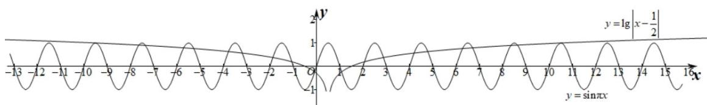
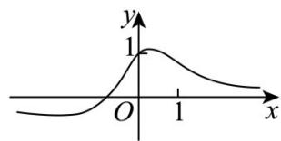
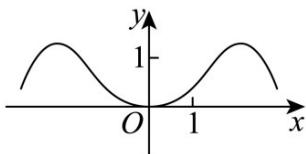
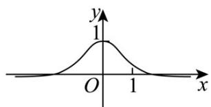
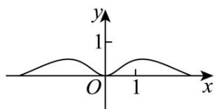

> [!faq]- 《专题03正弦函数、余弦函数的图像与性质的五大常考题型（高效培优专项训练）数学人教A版2019高一必修第一册》官方解析
>
> > [!success]- **【答案】** A. n = 10 B. n = 18 C. $x_{1} + x_{2} + \cdots + x_{n} = 10$ D. $x_{1} + x_{2} + \cdots + x_{n} = 9$
>
> > [!note]- **【解析】**
> > 令 $f(x) = \sin \pi x - \lg \left|x - \frac{1}{2}\right| = 0\Rightarrow \sin \pi x = \lg \left|x - \frac{1}{2}\right|$ 因为 $\sin \frac{21\pi}{2} = 1 = \lg \left|\frac{21}{2} -\frac{1}{2}\right|$ 且函数 $y = \sin \pi x,y = \lg \left|x - \frac{1}{2}\right|$ 的图象都关于 $x = \frac{1}{2}$ 对称，在同一直角坐标系，画出两个函数 $y = \sin \pi x, y = \lg \left|x - \frac{1}{2}\right|$ 图象如下图所示：
> >
> > 
> >
> > 由图可知共有 $^{20}$ 个交点，故n=20，则A，B错误；
> >
> > 又 $\frac{x_1 + x_{20}}{2} = \frac{x_2 + x_{19}}{2} = \dots = \frac{x_{10} + x_{11}}{2} = \frac{1}{2}$
> >
> > 故 $x_{1} + x_{2} + \cdots + x_{n} = x_{1} + x_{2} + \cdots + x_{20} = 10$ ，则 C 正确，D 错误，
> >
> > 故选：C
> >
> > 8. 函数 $f(x) = \frac{x\sin x}{1 + x^2}$ 在区间 $[-3, 3]$ 上的图像大致为（）
> >
> > 【答案】
> >
> > A
> >
> > 
> >
> > B
> >
> > 
> >
> > C
> >
> > 
> >
> > D
> >
> > 
> >
> > 【答案】D
> >
> > 【详解】由 $f(0)=0$ ，知A，C错误；
> >
> > 当 $x \neq 0$ 时，由 $\left|f(x)\right| = \frac{|x\sin x|}{1 + x^2} \leq \frac{|x|}{1 + x^2} \leq \frac{|x|}{2|x|} = \frac{1}{2}$ ，知 B 错误。
> >
> > 故选 **D**.
