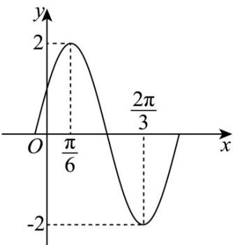

> [!faq]- 《专题03正弦函数、余弦函数的图像与性质的五大常考题型（高效培优专项训练）数学人教A版2019高一必修第一册》官方解析
>
> > [!success]- **【答案】** (1) $f(x)=2\sin\left(2x+\frac{2\pi}{3}\right)$ (2) $\left[\frac{5\pi}{12},\frac{11\pi}{12}\right]$ (3) $-\frac{1}{9}$
>
> > [!note]- **【解析】**
> > （1）由图可知 A = 2，
> >
> > $$
> > \frac {T}{4} = \frac {\pi}{6} - \left(- \frac {\pi}{1 2}\right) = \frac {\pi}{4}, T = \pi = \frac {2 \pi}{\omega}, \omega = 2
> > $$
> >
> > 则 $f(x) = 2\sin (2x + \varphi)$ ，由 $f\left(-\frac{\pi}{12}\right) = 2\sin \left(-\frac{\pi}{6} +\varphi\right) = 2$
> >
> > 得 $\sin \left(-\frac{\pi}{6} +\varphi\right) = 1$ ，则 $-\frac{\pi}{6} +\varphi = 2k\pi +\frac{\pi}{2},\varphi = 2k\pi +\frac{2\pi}{3},k\in Z$
> >
> > 由于 $0 < \varphi < \pi$ ，所以 $\varphi = \frac{2\pi}{3}$ ，所以 $f(x) = 2\sin \left(2x + \frac{2\pi}{3}\right)$ .
> >
> > (2) 由于 $-\frac{\pi}{2} + 2k\pi \leq 2x + \frac{2\pi}{3} \leq \frac{\pi}{2} + 2k\pi \Rightarrow -\frac{7\pi}{12} + k\pi \leq x \leq -\frac{\pi}{12} + k\pi, k \in \mathbb{Z}$
> >
> > 要使 $x \in [0, \pi]$ ，则令 $k = 1$ 得 $\frac{5\pi}{12} \leq x \leq \frac{7\pi}{12}$ ，
> >
> > 所以 $f(x)$ 在 $[0,\pi ]$ 上的单调增区间是 $\left[\frac{5\pi}{12},\frac{11\pi}{12}\right]$
> >
> > (3) $f\left(\frac{\alpha}{2}\right) = 2\sin \left(\alpha +\frac{2\pi}{3}\right) = \frac{4}{3},\sin \left(\alpha +\frac{2\pi}{3}\right) = \frac{2}{3}$
> >
> > $$
> > \sin^ {2} \left(\alpha + \frac {\pi}{6}\right) + \sin \left(\alpha - \frac {\pi}{3}\right) = \sin^ {2} \left(\alpha + \frac {2 \pi}{3} - \frac {\pi}{2}\right) + \sin \left(\alpha + \frac {2 \pi}{3} - \pi\right)
> > $$
> >
> > $$
> > = \cos^ {2} \left(\alpha + \frac {2 \pi}{3}\right) - \sin \left(\alpha + \frac {2 \pi}{3}\right)
> > $$
> >
> > $= 1 - \sin^2\left(\alpha +\frac{2\pi}{3}\right) - \sin \left(\alpha +\frac{2\pi}{3}\right)$
> >
> > $$
> > = 1 - \frac {4}{9} - \frac {2}{3} = - \frac {1}{9}
> > $$
> >
> > 10. 函数 $f(x) = A\sin (\omega x + \varphi)\left(A > 0, \omega > 0, |\varphi| < \frac{\pi}{2}\right)$ 的部分图象如图所示.
> >
> > 
> >
> > (1)求函数 $f(x)$ 的解析式；
> >
> > (2)若关于 $x$ 的方程 $f(x) - m = 0$ 在 $x \in \left[0, \frac{\pi}{2}\right]$ 上有两个不同的实数解，求实数 $m$ 的取值范围。
> >
> > 【答案】(1) $f(x)=2\sin\left(2x+\frac{\pi}{6}\right)$
> >
> > (2) $\left[1,2\right)$
> >
> > 【详解】（1）由函数图象可得 $A = 2$ ， $T = 2\left(\frac{2\pi}{3} -\frac{\pi}{6}\right) = \pi$ ， $\therefore \frac{2\pi}{\omega} = \pi$ ， $\therefore \omega = 2$
> >
> > 即 $f(x) = 2\sin (2x + \varphi)$ ，根据图象可得 $2\times \frac{\pi}{6} +\varphi = \frac{\pi}{2} +2k\pi$ ， $k\in \mathbb{Z}$ ，解得 $\varphi = \frac{\pi}{6} +2k\pi$ ， $k\in \mathbb{Z}$ ，
> >
> > 因为 $|\varphi| < \frac{\pi}{2}$ ，所以 $\varphi = \frac{\pi}{6}$ ，所以 $f(x) = 2\sin \left(2x + \frac{\pi}{6}\right)$
> >
> > $$
> > f (x) = 2 \sin \left(2 x + \frac {\pi}{6}\right), \therefore x \in \left[ 0, \frac {\pi}{2} \right], \therefore 2 x + \frac {\pi}{6} \in \left[ \frac {\pi}{6}, \frac {7 \pi}{6} \right] \tag {2}
> > $$
> >
> > 关于 $x$ 的方程 $f(x) - m = 0$ 在 $x \in \left[0, \frac{\pi}{2}\right]$ 上有两个不同的实数解，
> >
> > 则 $y = f(x)$ 与 $y = m$ 的图象有两个交点，结合函数图象可知 $m \in [1,2)$
> >
> > $\therefore$ 实数 $m$ 的取值范围为 $[1,2)$
