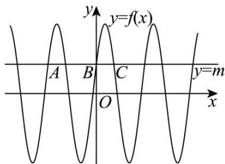

> [!faq]- 《专题03正弦函数、余弦函数的图像与性质的五大常考题型（高效培优专项训练）数学人教A版2019高一必修第一册》官方解析
>
> > [!success]- **【答案】** $\left\{t\mid t = 2n + \frac{\pi}{3} -k\pi ,k\in Z,n > 0,t > 0\right\} \cup \left\{t\mid t = -\frac{\pi}{2} -l\pi ,l\in Z,t > 0\right\}$
>
> > [!note]- **【解析】**
> > 由题意 $f(m) + f(n) = 0$ 等价于 $\sin \left(2m + \frac{\pi}{3}\right) = -\sin \left(2n + \frac{\pi}{3}\right) = \sin \left(-2n - \frac{\pi}{3}\right)$ ，
> >
> > 所以 $2m + \frac{\pi}{3} = -2n - \frac{\pi}{3} + 2k\pi, k \in \mathbb{Z}$ 或 $2m + \frac{\pi}{3} = \pi - \left(-2n - \frac{\pi}{3}\right) + 2l\pi, l \in \mathbb{Z}$ ，
> >
> > 解得 $m = -n - \frac{\pi}{3} + k\pi, k \in \mathbb{Z}$ ，或 $m = n + \frac{\pi}{2} + l\pi, l \in \mathbb{Z}$
> >
> > 所以 $n - m = 2n + \frac{\pi}{3} - k\pi, k \in \mathbb{Z}$ ， $n - m = -\frac{\pi}{2} - l\pi, l \in \mathbb{Z}$ ，
> >
> > 故所求范围为 $\left\{t \mid t = 2n + \frac{\pi}{3} - k\pi, k \in \mathbb{Z}, n > 0, t > 0\right\} \cup \left\{t \mid t = -\frac{\pi}{2} - l\pi, l \in \mathbb{Z}, t > 0\right\}$ .
> >
> > 故答案为： $\left\{t\mid t = 2n + \frac{\pi}{3} -k\pi ,k\in Z,n > 0,t > 0\right\} \cup \left\{t\mid t = -\frac{\pi}{2} -l\pi ,l\in Z,t > 0\right\} .$
> >
> > 22. 直线 $y = m(m > 0)$ 与函数 $f(x) = 4\sin (2x + \varphi)$ 图像的相邻的三个交点从左自右依次为 A、B、C，若 $|AB| = 2|BC|$ ，则 $m =$ \_\_\_\_.
> >
> > 【答案】2
> >
> > 【详解】由正弦函数性质得 $f(x)$ 的周期为 $T = \frac{2\pi}{2} = \pi$
> >
> > 如图，由题意得直线 $y = m$ 与函数 $f(x)$ 图像的相邻的三个交点，
> >
> > 从左自右依次为 A、B、C，
> >
> > 
> >
> > 则 $|AC|=T=\pi$ ，因为 $|AB|=2|BC|$ ，所以 $|BC|+2|BC|= \pi$
> >
> > 解得 $\left|BC\right|=\frac{\pi}{3}$ ，令 $2x+\varphi=\frac{\pi}{2}+2k\pi,k\in\mathbb{Z}$ ，解得 $x=\frac{\pi}{4}+k\pi-\frac{\varphi}{2},k\in\mathbb{Z}$
> >
> > 由正弦函数性质得 $_{B}$ 、C关于 $x=\frac{\pi}{4}+k\pi-\frac{\varphi}{2}$ 对称，且设 $_{B}$ 的横坐标为 $x_{1}$ ，
> >
> > 则 $x_{1} = \frac{\pi}{4} + k\pi -\frac{\varphi}{2} -\frac{\pi}{6} = \frac{\pi}{12} +k\pi -\frac{\varphi}{2},k\in Z$
> >
> > 而 $_{B}$ 的纵坐标为 m，代入解析式中得到 $m = 4\sin\left[2\left(\frac{\pi}{12} + k\pi - \frac{\varphi}{2}\right) + \varphi\right]$ ，
> >
> > $= 4\sin \left[\frac{\pi}{6} +2k\pi -\varphi +\varphi \right] = 4\sin \left(\frac{\pi}{6} +2k\pi\right) = 4\sin \frac{\pi}{6} = 2.$
> >
> > 故答案为：2
