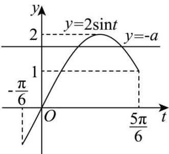

> [!faq]- 《专题03正弦函数、余弦函数的图像与性质的五大常考题型（高效培优专项训练）数学人教A版2019高一必修第一册》官方解析
>
> > [!success]- **【答案】** (1) $\pi$ ， $\left[-\frac{\pi}{6} + k\pi, \frac{\pi}{3} + k\pi\right], k \in Z$ (2) $\frac{\pi}{2}<m\leq\frac{5\pi}{6}$ (3) $-2 < a \leq -1$ .
>
> > [!note]- **【解析】**
> > （1） $f(x)=2\sin\left(2x-\frac{\pi}{6}\right)$ ，所以函数的最小正周期为 $T=\frac{2\pi}{2}=\pi$ .
> >
> > 令 $-\frac{\pi}{2} + 2k\pi \leq 2x - \frac{\pi}{6} \leq \frac{\pi}{2} + 2k\pi$ ，解得 $-\frac{\pi}{6} + k\pi \leq x \leq \frac{\pi}{3} + k\pi$
> >
> > 所以函数 $f(x)$ 的单调递增区间为 $\left[-\frac{\pi}{6} + k\pi, \frac{\pi}{3} + k\pi\right], k \in \mathbb{Z}$ .
> >
> > (2) 当 $x \in \left[\frac{\pi}{2}, m\right]$ 时， $2x - \frac{\pi}{6} \in \left[\frac{5\pi}{6}, 2m - \frac{\pi}{6}\right]$ ，
> >
> > 因为 $f(x)$ 在区间 $\left[\frac{\pi}{2}, m\right]$ 上单调递减，所以 $\frac{5\pi}{6} < 2m - \frac{\pi}{6} \leq \frac{3\pi}{2}$ ，解得 $\frac{\pi}{2} < m \leq \frac{5\pi}{6}$ . 所以实数 $m$ 的取值范围是 $\frac{\pi}{2} < m \leq \frac{5\pi}{6}$ .
> >
> > (3) 令 $t = 2x - \frac{\pi}{6}$ , $\because x \in \left[0, \frac{\pi}{2}\right]$ , $\therefore t = 2x - \frac{\pi}{6} \in \left[-\frac{\pi}{6}, \frac{5\pi}{6}\right]$ .
> >
> > 因为方程 $f(x)+a=0$ 有两个不相等的实数根，
> >
> > 所以函数 $y = -a$ 与函数 $y = \sin t, t \in \left[-\frac{\pi}{6}, \frac{5\pi}{6}\right]$ 的图象有两个交点.
> >
> > 结合图象得， $1 \leq -a < 2$ ，解得， $-2 < a \leq -1$ 。
> >
> > 
> >
> > 所以实数 a 的取值范围是 $-2 < a \leq -1$ .
