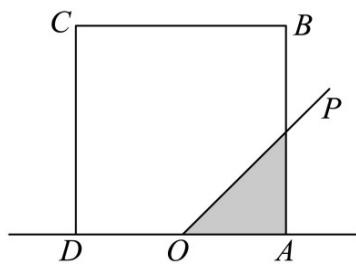

<!-- question-source:start -->
2. 如图，正方形 $ABCD$ 的边长为 $2$ ， $O$ 为 $AD$ 的中点，射线 $OP$ 从 $OA$ 出发，绕着点 $O$ 按逆时针方向旋转至 $OD$ 在旋转的过程中，记 $\angle AOP$ 为 $x$ ， $OP$ 所经过的正方形 $ABCD$ 内部的区域（阴影部分）的面积为 $f(x)$ 对于函数 $f(x)$ 给出以下4个结论：

① $f\left(\frac{\pi}{4}\right)=\frac{1}{2}$ ；②函数 $f(x)$ 在 $\left(\frac{\pi}{2},\pi\right)$ 为减函数；

③ $f(x)+f(\pi-x)=4$ ；④ $f(x)$ 的图象关于直线 $x=\frac{\pi}{2}$ 对称。

其中正确结论的序号为\_\_\_\_。

<!-- question-source:end -->

![[高中/课堂同步/题库/人教A版高中数学同步讲义(2026)/01_必修第一册/第五章 三角函数/专题04正切函数的图像与性质的五大常考题型（高效培优专项训练）数学人教A版2019高一必修第一册/题型一_正切函数的对称性问题/questions/answers/Q00076122A1.md]]
