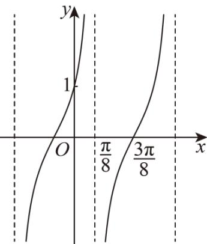

> [!faq]- 《专题04正切函数的图像与性质的五大常考题型（高效培优专项训练）数学人教A版2019高一必修第一册》官方解析
>
> > [!success]- **【答案】** 
>
> > [!note]- **【解析】**
> > 由题意可知： $f(x)$ 的最小正周期 $T = \left(\frac{3\pi}{8} - \frac{\pi}{8}\right) \times 2 = \frac{\pi}{2}$
> >
> > 且 $\omega > 0$ ，可得 $\omega = \frac{\pi}{T} = \frac{\pi}{\frac{\pi}{2}} = 2$
> >
> > 又因为 $f\left(\frac{3\pi}{8}\right) = \tan \left(2\times \frac{3\pi}{8} +\varphi\right) = \tan \left(\frac{3\pi}{4} +\varphi\right) = 0$
> >
> > 且 $-\frac{\pi}{2} < \varphi < \frac{\pi}{2}$ ，则 $\frac{\pi}{4} < \frac{3\pi}{4} + \varphi < \frac{5\pi}{4}$ ，
> >
> > 可得 $\frac{3\pi}{4} +\varphi = \pi$ ，即 $\varphi = \frac{\pi}{4}$
> >
> > 且 $f(0) = A\tan \left(2\times 0 + \frac{\pi}{4}\right) = A\tan \frac{\pi}{4} = A = 1$ ，即 $A = 1$
> >
> > 可得 $f(x)=\tan\left(2x+\frac{\pi}{4}\right)$ ，
> >
> > 所以 $f\left(\frac{7\pi}{24}\right) = \tan \left(2\times \frac{7\pi}{24} +\frac{\pi}{4}\right) = \tan \left(\pi -\frac{\pi}{6}\right) = -\tan \frac{\pi}{6} = -\frac{\sqrt{3}}{3}$
> >
> > 故答案为： $-\frac{\sqrt{3}}{3}$
