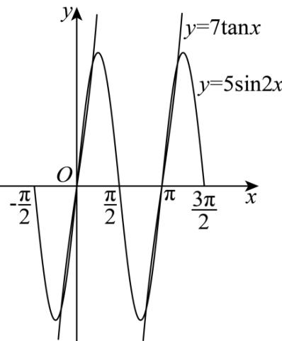

> [!faq]- 《专题04正切函数的图像与性质的五大常考题型（高效培优专项训练）数学人教A版2019高一必修第一册》官方解析
>
> > [!success]- **【答案】** $3\pi$
>
> > [!note]- **【解析】**
> > 因为 $f(x) = 7\tan x$ 的对称中心为 $\left(\frac{k\pi}{2},0\right)$ ， $k \in \mathbb{Z}$ ，
> >
> > $g(x) = 5\sin 2x$ 的对称中心为 $\left(\frac{k\pi}{2},0\right)$ ， $k\in Z$
> >
> > 所以两函数的交点也关于 $\left(\frac{k\pi}{2},0\right)$ 对称， $k\in \mathbb{Z}$
> >
> > 又因为函数 $f(x) = 7\tan x$ ， $g(x) = 5\sin 2x$ 的最小正周期为 $\pi$ ，
> >
> > 作出两函数的在 $x \in \left[-\frac{\pi}{2}, \frac{3\pi}{2}\right]$ 的图象，如下图，
> >
> > 
> >
> > 由此可得两函数图象共 $^{6}$ 个交点，设这 $^{6}$ 个交点的横坐标依次为 $x_{1}, x_{2}, x_{3}, x_{4}, x_{5}, x_{6}$
> >
> > 且 $x_{1} <   x_{2} <   x_{3} <   x_{4} <   x_{5} <   x_{6}$
> >
> > 其中 $x_{1}, x_{3}$ 关于 $(0, 0)$ 对称， $x_{2} = 0$ ， $x_{4}, x_{6}$ 关于 $(\pi, 0)$ 对称， $x_{5} = \pi$
> >
> > 所以 $x_{1} + x_{2} + x_{3} + x_{4} + x_{5} + x_{6} = 3\pi$ .
> >
> > 故答案为： $3\pi$
