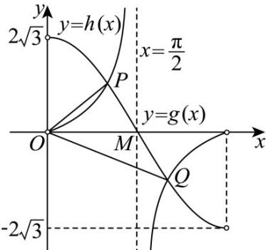

> [!faq]- 《专题04正切函数的图像与性质的五大常考题型（高效培优专项训练）数学人教A版2019高一必修第一册》官方解析
>
> > [!success]- **【答案】** (1) $\omega = 1$ (2) $f(x)$ 在区间 $\left[-\pi, -\frac{\pi}{6}\right]$ 上单调递减，在区间 $\left(-\frac{\pi}{6}, \frac{5\pi}{6}\right)$ 上单调递增，在区间 $\left[\frac{5\pi}{6}, \pi\right]$ 上单调递减 (3) $\frac{\sqrt{3}\pi}{2}$
>
> > [!note]- **【解析】**
> > （1）因为 $f(x)$ 的图象关于点 $\left(\frac{\pi}{3},0\right)$ 中心对称，则 $f\left(\frac{\pi}{3}\right)=2\sqrt{3}\cos\left(\frac{\omega\pi}{3}-\frac{5\pi}{6}\right)=0$
> >
> > 即 $\cos \left(\frac{\omega\pi}{3} -\frac{5\pi}{6}\right) = 0$ ，可得 $\frac{\omega\pi}{3} -\frac{5\pi}{6} = \frac{\pi}{2} +k\pi (k\in \mathbf{Z})$ ，解得 $\omega = 4 + 3k(k\in \mathbf{Z})$
> >
> > 且 $0 < \omega \leq 3$ ，所以 $k = 0, \omega = 1$ ：
> >
> > (2) 由 (1) 可知 $f(x) = 2\sqrt{3} \cos \left( x - \frac{5\pi}{6} \right)$ ,
> >
> > 当 $x \in [-\pi, \pi]$ 时，则 $x - \frac{5\pi}{6} \in \left[-\frac{11\pi}{6}, \frac{\pi}{6}\right]$
> >
> > 函数 $y = \cos x$ 在区间 $\left[-\frac{11\pi}{6}, -\pi\right]$ 上单调递减，在区间 $(- \pi, 0)$ 上单调递增，在区间 $\left[0, \frac{\pi}{6}\right]$ 上单调递减令 $x - \frac{5\pi}{6} = -\pi$ ，可得 $x = -\frac{\pi}{6}$ ，令 $x - \frac{5\pi}{6} = 0$ ，可得 $x = \frac{5\pi}{6}$ ，
> >
> > 所以 $f(x)$ 在区间 $\left[-\pi, -\frac{\pi}{6}\right]$ 上单调递减，在区间 $\left(-\frac{\pi}{6}, \frac{5\pi}{6}\right)$ 上单调递增，在区间 $\left[\frac{5\pi}{6}, \pi\right]$ 上单调递减（3）由（2）可知 $g(x) = f\left(x + \frac{5\pi}{6}\right) = 2\sqrt{3} \cos x$ ， $x \in (0, \pi)$ ，
> >
> > 令 $2\sqrt{3}\cos x = \tan x = \frac{\sin x}{\cos x}$ ，可得 $2\sqrt{3}\cos^2 x = \sin x$
> >
> > 即 $2\sqrt{3}\left(1 - \sin^2 x\right) = \sin x$ ，解得 $\sin x = \frac{\sqrt{3}}{2}$ 或 $-\frac{2\sqrt{3}}{3}$ （舍去），
> >
> > 又因为 $0 < x < \pi$ ，可得 $x = \frac{\pi}{3}$ 或 $\frac{2\pi}{3}$ ，
> >
> > 因为 $\tan \frac{\pi}{3} = \sqrt{3}$ ， $\tan \frac{2\pi}{3} = -\sqrt{3}$ ，不妨设 $P\left(\frac{\pi}{3},\sqrt{3}\right)$ ， $Q\left(\frac{2\pi}{3}, - \sqrt{3}\right)$
> >
> > 则 $_{P}$ ，Q两点关于点 $M\left(\frac{\pi}{2},0\right)$ 对称，
> >
> > 
> >
> > 所以 $\triangle OPQ$ 的面积 $S = 2S_{\triangle OPM} = 2 \times \frac{1}{2} \times \frac{\pi}{2} \times \sqrt{3} = \frac{\sqrt{3}\pi}{2}$ .
