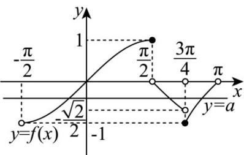

> [!faq]- 《专题04正切函数的图像与性质的五大常考题型（高效培优专项训练）数学人教A版2019高一必修第一册》官方解析
>
> > [!success]- **【答案】** $\left[-1,1\right]$ ; $\left(-\frac{\sqrt{2}}{2},0\right)$ .
>
> > [!note]- **【解析】**
> > 当 $x \in \left(-\frac{\pi}{2}, \frac{\pi}{2}\right]$ 时， $\sin x \in (-1, 1]$ ；
> >
> > 当 $x \in \left(\frac{\pi}{2}, \frac{3\pi}{4}\right)$ 时， $\cos x \in \left(-\frac{\sqrt{2}}{2}, 0\right)$ ；
> >
> > 当 $x \in \left[\frac{3\pi}{4}, \pi\right)$ 时， $\tan x \in [-1, 0)$ .
> >
> > 综上，函数 $f(x)$ 的值域为 $[-1, 1]$ .
> >
> > 作出函数 $f(x)$ 的图象如图：
> >
> > 
> >
> > 因为关于 x 的方程 $f(x)-a=0$ 恰有三个不相等的实数根，
> >
> > 所以直线 $y = a$ 与函数 $f(x)$ 的图象有三个交点，
> >
> > 由图可知， $-\frac{\sqrt{2}}{2} < a < 0$ ，即实数 $a$ 的取值范围为 $\left(-\frac{\sqrt{2}}{2},0\right)$
> >
> > 故答案为： $\left[-1,1\right]$ ; $\left(-\frac{\sqrt{2}}{2},0\right)$ .
> >
> > 24. 函数 $f(x) = \tan^2 x - \tan x$ ， $x \in \left[-\frac{\pi}{4}, \frac{\pi}{4}\right]$ 的最大值与最小值之和为 \_\_\_\_.
> >
> > 【答案】 $\frac{7}{4}$
> >
> > 【详解】令 $\tan x = t$ ，∵ $x \in \left[-\frac{\pi}{4}, \frac{\pi}{4}\right]$ ， $t \in [-1, 1]$ ，
> >
> > 则 $y = t^2 - t = \left(t - \frac{1}{2}\right)^2 - \frac{1}{4}$ ，因为对称轴为 $t = \frac{1}{2}$
> >
> > 所以 $y = t^2 - t$ ，在 $t \in \left[-1, \frac{1}{2}\right]$ 上单调递减，在 $t \in \left(\frac{1}{2}, 1\right]$ 上单调递增，
> >
> > 所以，当 $t = -1$ 时， $y_{\max} = 2$ ，当 $t = \frac{1}{2}$ 时， $y_{\min} = -\frac{1}{4}$
> >
> > 函数 $f(x) = \tan^2 x - \tan x$ 的最大值与最小值之和为 $2 - \frac{1}{4} = \frac{7}{4}$ .
> >
> > 故答案为： $\frac{7}{4}$
