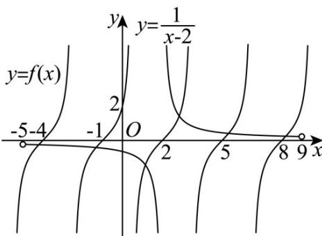

> [!faq]- 《专题04正切函数的图像与性质的五大常考题型（高效培优专项训练）数学人教A版2019高一必修第一册》官方解析
>
> > [!success]- **【答案】** 2696
>
> > [!note]- **【解析】**
> > 依题意，因为函数 $f(x)$ 的相邻两个对称中心的距离为 $\frac{3}{2}$
> >
> > 则函数 $f(x) = \tan (\omega x + \varphi)$ 的最小正周期为3，即 $\frac{\pi}{\omega} = 3$ ，得 $\omega = \frac{\pi}{3}$
> >
> > 则 $f(x) = \tan \left(\frac{\pi}{3} x + \varphi\right)$
> >
> > 又 $f(1) = -\sqrt{3}$ ，即 $\tan \left(\frac{\pi}{3} + \varphi\right) = -\sqrt{3}$ ，
> >
> > 所以 $\frac{\pi}{3} +\varphi = \frac{2\pi}{3} +k\pi$
> >
> > 因为 $0 < \varphi < \frac{\pi}{2}$ ，所以 $\varphi = \frac{\pi}{3}$ ，
> >
> > 故 $f(x)=\tan\left(\frac{\pi}{3}x+\frac{\pi}{3}\right)$ ，
> >
> > 又因为 $f(2) = \tan \left(\frac{2\pi}{3} + \frac{\pi}{3}\right) = 0$ ，所以 $y = f(x)$ 关于 $(2,0)$ 中心对称，
> >
> > 而 $y = \frac{1}{x - 2}$ 也关于(2,0)中心对称，
> >
> > 作出两个函数在原点附近的部分图象，
> >
> > 
> >
> > 在 $-2019 < x < 2023$ 且 $x \neq 2$ 内，函数 $f(x)$ 的最小正周期为3，
> >
> > 又 $(-2019,0)$ 和 $(2023,0)$ 也关于 $(2,0)$ 对称， $\frac{2023 - 2}{3} = 673\frac{2}{3}$
> >
> > 因为在 $(2,0)$ 的右边从第一个周期起两个函数的图象交点都在前半个周期内，
> >
> > 则函数 $y = f(x)$ 的图像与函数 $y = \frac{1}{x - 2}$ 的图象的交点有674对，
> >
> > 设两图象的交点的横坐标由小到大为： $x_{1}, x_{2}, \cdots, x_{1348}$
> >
> > 若 $\left(x_{1},y_{1}\right)$ 是交点，则 $\left(4-x_{1},-y_{1}\right)$ 也是交点，则 $x_{1}+x_{1348}=4,x_{2}+x_{1347}=4,\cdots$
> >
> > 所以，所有交点横坐标之和为 $674 \times 4 = 2696$ .
> >
> > 故答案为：2696·
