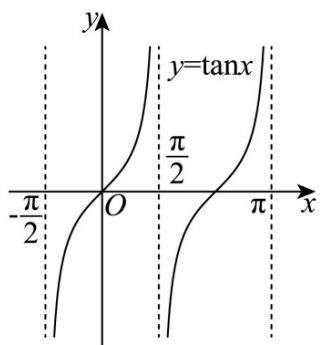
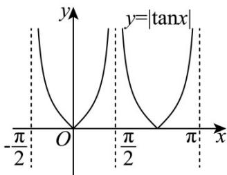

> [!faq]- 《专题04正切函数的图像与性质的五大常考题型（高效培优专项训练）数学人教A版2019高一必修第一册》官方解析
>
> > [!success]- **【答案】** $[0, + \infty)$
>
> > [!note]- **【解析】**
> > 因为 $g(-x)=\sqrt{3}\left|\sin x\right|+\left|\tan x\right|=g(x)$ ，定义域为 $\{x\mid x\neq k\pi+\frac{\pi}{2},k\in Z\}$ ，故 $g(x)$ 为偶函数；
> >
> > 又 $g(x + \pi) = \sqrt{3} |\sin (x + \pi)| + |\tan (x + \pi)| = \sqrt{3} |\sin x| + |\tan x| = g(x)$ ，故 $g(x)$ 的一个周期为 $\pi$ ；
> >
> > 根据题意可得： $g(x)$ 的值域，也就是 $g(x)$ 在 $\left(-\frac{\pi}{2},\frac{\pi}{2}\right)$ 的值域，也就是 $\left[0,\frac{\pi}{2}\right)$ 上的值域；
> >
> > 当 $x \in \left[0, \frac{\pi}{2}\right)$ ， $g(x) = \sqrt{3} \sin x + \tan x$ ，又 $y = \sin x, y = \tan x$ 在 $\left[0, \frac{\pi}{2}\right)$ 上均为单调增函数，故 $g(x)$ 在 $\left[0, \frac{\pi}{2}\right)$ 单调递增，
> >
> > 又 $g(0) = 0$ ，当 $x$ 趋近于 $\frac{\pi}{2}$ 时， $g(x)$ 趋近于 $+\infty$ ，故 $g(x)$ 的值域为 $[0, +\infty)$
> >
> > 故答案为： $\left[0,+\infty\right)$ .
> >
> > 15. 函数 $y = \left|\tan \left(-3x + \frac{\pi}{4}\right)\right|$ 的最小正周期是 \_\_\_\_.
> >
> > 【答案】 $\frac{\pi}{3} / \frac{1}{3}\pi$
> >
> > 【详解】由正切函数的图象与性质知： $y = \tan x$ 与 $y = |\tan x|$ 的最小周期均为 $\pi$ ， $y = \tan x$ 与 $y = |\tan x|$ 的图象如图所示，
> >
> > 
> >
> > 
> >
> > 所以函数 $y = \tan \left(-3x + \frac{\pi}{4}\right)$ 与 $y = \left|\tan \left(-3x + \frac{\pi}{4}\right)\right|$ 最小正周期也一样，
> >
> > 函数 $y = \tan \left(-3x + \frac{\pi}{4}\right)$ 的最小正周期是 $T = \frac{\pi}{|\omega|} = \frac{\pi}{3}$ ，
> >
> > $y = \left|\tan \left(-3x + \frac{\pi}{4}\right)\right|$ 的最小正周期也是 $\frac{\pi}{3}$
> >
> > 故答案为： $\frac{\pi}{3}$
