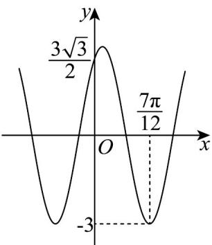

<!-- question-source:start -->
8. 已知函数 $f(x) = A\cos (\omega x + \varphi)\left(A > 0, \omega > 0, -\frac{\pi}{2} < \varphi < 0\right)$ 的部分图象如图所示.

(1)求函数 $f(x)$ 的解析式；

(2)将函数 $f(x)$ 的图象上所有点的横坐标伸长到原来的2倍（纵坐标不变），得到 $y = g(x)$ 的图象，若 $\alpha \in \left[\frac{\pi}{2}, \frac{2\pi}{3}\right]$ ，且 $g(\alpha) = 1$ ，求 $\sin \left(2\alpha - \frac{\pi}{6}\right)$ 的值。
<!-- question-source:end -->

![[高中/课堂同步/题库/人教A版高中数学同步讲义(2026)/01_必修第一册/第五章 三角函数/专题06函数函数y＝Asin(ωx＋φ)及函数的应用的四大常考题型（高效培优专项训练）数学人教A版2019高一必修第一册/题型一_求图象变换前_后的解析式/questions/answers/Q00076213A1.md]]
