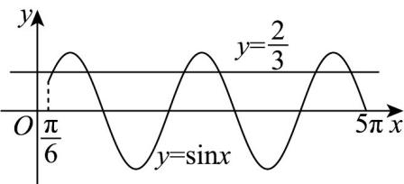

> [!faq]- 《专题06函数函数y＝Asin(ωx＋φ)及函数的应用的四大常考题型（高效培优专项训练）数学人教A版2019高一必修第一册》官方解析
>
> > [!success]- **【答案】** $\frac{14\pi}{3}$
>
> > [!note]- **【解析】**
> > 将函数 $f(x)$ 的图象向右平移 $\frac{\pi}{6}$ 个单位长度，可得 $y = 2\sin \left(2x - \frac{\pi}{3}\right)$ 的图象，
> >
> > 再把横坐标缩小为原来 $\frac{1}{2}$ 的，得到函数 $y = 2\sin \left(4x - \frac{\pi}{3}\right)$ 的图象，
> >
> > 所以 $g(x) = 2\sin \left(4x - \frac{\pi}{3}\right)$ ，由 $g(x) = \frac{4}{3}$ ，可得 $\sin \left(4x - \frac{\pi}{3}\right) = \frac{2}{3}$ ，
> >
> > 因为 $x \in \left[\frac{\pi}{6}, \frac{4\pi}{3}\right]$ ，可得 $4x - \frac{\pi}{3} \in \left[\frac{\pi}{6}, 5\pi\right]$
> >
> > 设 $\theta = 4x - \frac{\pi}{3}$ ，则 $\theta \in \left[\frac{\pi}{6},5\pi \right]$ ，即 $\sin \theta = \frac{2}{3}$
> >
> > 结合正弦函数 $y = \sin x$ ， $x \in \left[\frac{\pi}{6}, 5\pi\right]$ 的图象，如图，
> >
> > 
> >
> > 可得方程 $\sin \theta = \frac{2}{3}$ 在区间 $\left[\frac{\pi}{6}, 5\pi\right]$ 有 $^6$ 个解，
> >
> > 可得 $\theta_{1} + \theta_{2} = \pi, \theta_{2} + \theta_{3} = 3\pi, \theta_{3} + \theta_{4} = 5\pi, \theta_{4} + \theta_{5} = 7\pi$
> >
> > 即 $4x_{1} - \frac{\pi}{3} + 4x_{2} - \frac{\pi}{3} = \pi, 4x_{2} - \frac{\pi}{3} + 4x_{3} - \frac{\pi}{3} = 3\pi$
> >
> > $4x_{3} - \frac{\pi}{3} + 4x_{4} - \frac{\pi}{3} = 5\pi, 4x_{4} - \frac{\pi}{3} + 4x_{5} - \frac{\pi}{3} = 7\pi$
> >
> > 所以 $x_{1} + x_{2} = \frac{5\pi}{12}, x_{2} + x_{3} = \frac{11\pi}{12}$ ， $x_{3} + x_{4} = \frac{17\pi}{12}, x_{4} + x_{5} = \frac{23\pi}{12}$ ，
> >
> > 所以 $x_{1}+2x_{2}+2x_{3}+2x_{4}+x_{5}=\frac{56\pi}{12}=\frac{14\pi}{3}$ .
> >
> > 故答案为： $\frac{14\pi}{3}$
