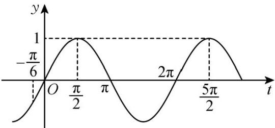

> [!faq]- 《专题06函数函数y＝Asin(ωx＋φ)及函数的应用的四大常考题型（高效培优专项训练）数学人教A版2019高一必修第一册》官方解析
>
> > [!success]- **【答案】** $\frac{5}{2} / 2.5$
>
> > [!note]- **【解析】**
> > 由题意，可得 $g(x) = f\left(x + \frac{4\pi}{15}\right) = \sin \left(\omega x + \frac{4\omega\pi}{15} -\frac{\pi}{6}\right)$ 是偶函数，
> >
> > 则 $\frac{4\omega\pi}{15} -\frac{\pi}{6} = k\pi +\frac{\pi}{2},k\in Z$ ，可得 $\omega = \frac{15}{4} k + \frac{5}{2}\big(k\in Z\big)$
> >
> > 又由 $f(x) = 0$ 在 $\left(0, \frac{\pi}{2}\right)$ 上恰有2个解，即 $\sin \left(\omega x - \frac{\pi}{6}\right) = 0$ 在 $\left(0, \frac{\pi}{2}\right)$ 上恰有2个解，
> >
> > 因为 $x \in \left(0, \frac{\pi}{2}\right)$ 时，可得 $t = \omega x - \frac{\pi}{6} \in \left(-\frac{\pi}{6}, \frac{\omega \pi}{2} - \frac{\pi}{6}\right)$
> >
> > 所以 $y = \sin t$ 在 $t\in \left(-\frac{\pi}{6},\frac{\omega\pi}{2} -\frac{\pi}{6}\right)$ 上恰有2个解，
> >
> > 由 $y = \sin t$ 图象性质，可得 $\pi < \frac{\omega\pi}{2} - \frac{\pi}{6} \leq 2\pi$ ，可得 $\frac{7}{3} < \omega \leq \frac{13}{3}$ .
> >
> > 又因为 $\omega > 0$ ，所以只有当 $k = 0$ 时， $\omega = \frac{5}{2}$ 符合题意，所以 $\omega = \frac{5}{2}$ 。故答案为： $\frac{5}{2}$ 。
> >
> > 
