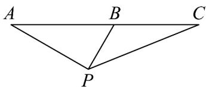

<!-- question-source:start -->
23. 如图，某侦察飞机沿水平直线 $AC$ 匀速飞行。在 $A$ 处观测地面目标 $P$ ，测得俯角 $\angle BAP = 30^{\circ}$ 。飞行 $3\mathrm{min}$ 后到达 $B$ 处，此时观测地面目标 $P$ ，测得俯角 $\angle ABP = 60^{\circ}$ 。又飞行一段时间后到达 $C$ 处，此时观测地面目标 $P$ ，测得俯角 $\angle BCP$ 的余弦值为 $\frac{13}{14}$ ，则该侦察飞机由 $B$ 至 $C$ 的飞行时间为 $\text{———} \mathrm{min}$ 。

<!-- question-source:end -->

![[高中/课堂同步/题库/人教A版高中数学同步讲义(2026)/01_必修第一册/第五章 三角函数/专题06函数函数y＝Asin(ωx＋φ)及函数的应用的四大常考题型（高效培优专项训练）数学人教A版2019高一必修第一册/题型三_三角函数模型的实际应用/questions/answers/Q00076224A1.md]]
