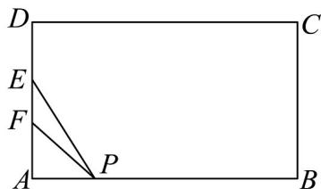

<!-- question-source:start -->
25．在高一年级两个班级某场足球比赛中，比赛场地为矩形ABCD（如图），现已知矩形中AB=42米，AD=25米，宽为7米的足球门EF在边AD的中间放置，AF=DE·比赛中，同学甲在边线BA上带球突破（视作点P在BA边上移动），准备起脚向球门EF射门，不考虑场上其他因素，要使该同学射门角度最佳（即当 $\angle EPF$ 最大时），PA长应为\_\_\_\_米·

<!-- question-source:end -->

![[高中/课堂同步/题库/人教A版高中数学同步讲义(2026)/01_必修第一册/第五章 三角函数/专题06函数函数y＝Asin(ωx＋φ)及函数的应用的四大常考题型（高效培优专项训练）数学人教A版2019高一必修第一册/题型三_三角函数模型的实际应用/questions/answers/Q00076226A1.md]]
