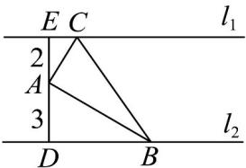

<!-- question-source:start -->
26. 如图，已知直线 $l_{1} // l_{2}, A$ 是 $l_{1}, l_{2}$ 之间的一定点，并且点A到 $l_{1}, l_{2}$ 的距离分别是 $^{2,3}$ ， $B$ 是直线 $l_{2}$ 上的动

点，作 $AC \perp AB$ ，且使 $AC$ 与直线 $l_{1}$ 交于点 $C$ 。则VABC的面积的最小值是

<!-- question-source:end -->

![[高中/课堂同步/题库/人教A版高中数学同步讲义(2026)/01_必修第一册/第五章 三角函数/专题06函数函数y＝Asin(ωx＋φ)及函数的应用的四大常考题型（高效培优专项训练）数学人教A版2019高一必修第一册/题型三_三角函数模型的实际应用/questions/answers/Q00076227A1.md]]
