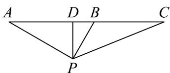

> [!faq]- 《专题06函数函数y＝Asin(ωx＋φ)及函数的应用的四大常考题型（高效培优专项训练）数学人教A版2019高一必修第一册》官方解析
>
> > [!success]- **【答案】** 2.5
>
> > [!note]- **【解析】**
> > 设飞机的飞行速度为 vkm/min ，根据飞机的飞行图形，
> >
> > 测得俯角为 $\angle BAP = 30^{\circ}$ ，飞行 $3\mathrm{min}$ 后到达 $B$ 处观测地面目标 $P$ ，测得俯角 $\angle ABP = 60^{\circ}$
> >
> > 所以 $\triangle ABP$ 为直角三角形，
> >
> > 
> >
> > 过点 $P$ 作 $PD \perp AC$ 于点 $D$ ，则 $AB = 3v, AP = \frac{3\sqrt{3}}{2}v, BP = \frac{3}{2}v$
> >
> > 则 $DP = \frac{3\sqrt{3}}{4} v, DB = \frac{3}{4} v$
> >
> > 设飞机由 B 至 C 的飞行时间为 x 分钟，则 CB = xv，
> >
> > 由 $\cos \angle BCP = \frac{13}{14}$ ，可得 $\sin \angle BCP = \frac{3\sqrt{3}}{14}$
> >
> > 则 $\tan \angle BCP = \frac{\sin\angle BCP}{\cos\angle BCP} = \frac{3\sqrt{3}}{13}$
> >
> > 又由 $\tan\angle BCP=\frac{\frac{3\sqrt{3}}{4}v}{\frac{3}{4}v+xv}=\frac{3\sqrt{3}}{13}$ ，解得 x=2.5
> >
> > 故答案为：2.5·
