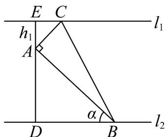
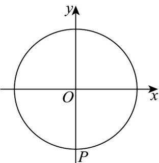

> [!faq]- 《专题06函数函数y＝Asin(ωx＋φ)及函数的应用的四大常考题型（高效培优专项训练）数学人教A版2019高一必修第一册》官方解析
>
> > [!success]- **【答案】** 
>
> > [!note]- **【解析】**
> > $\because AE \perp l_{1}, AD \perp l_{2}, AC \perp AB, \therefore \angle ABD + \angle BAD = \frac{\pi}{2}, \angle CAE + \angle BAD = \frac{\pi}{2}$
> >
> > $$
> > \therefore \angle C A E = \angle A B D = \alpha , \therefore A B = \frac {h _ {2}}{\sin \alpha} = \frac {6}{\sin \alpha}, A C = \frac {h _ {1}}{\cos \alpha} = \frac {2}{\cos \alpha},
> > $$
> >
> > $\therefore S(\alpha) = \frac{1}{2} AB \cdot AC = \frac{12}{2\sin\alpha\cos\alpha} = \frac{12}{\sin 2\alpha}\left(0 < \alpha < \frac{\pi}{2}\right)$ .
> >
> > $\therefore 0 < \alpha < \frac{\pi}{2}$ ， $\therefore 0 < 2\alpha < \pi$ ，即 $0 < \sin 2\alpha \leq 1$ ，∴当 $\alpha = \frac{\pi}{4}$
> >
> > 即 $2\alpha = \frac{\pi}{2}$ 时， $S(\alpha)$ 取最小值， $S(\alpha)$ 的最小值为 $S\left(\frac{\pi}{4}\right) = 12$ 。
> >
> > 故答案为： $\frac{12}{\sin 2\alpha}\left(0 <   \alpha <  \frac{\pi}{2}\right)$ ；12.
> >
> > 28. 奉贤中学生物创新实验室一天的温度 $y$ （单位：℃）随时间 $t$ （单位：h）的变化近似满足函数关系： $y = 10 - A\sin \left( \frac{\pi}{12} t + \theta \right)$ ，其中 $A > 0, t \in [0,24)$ ·随着人工智能的普及，该实验室引进了AI管理系统，可以根据实际需求设定参数A和 $\theta$ 的取值。
> >
> > (1)若设定 $\theta = \frac{\pi}{3}$ ，且要求实验室一天的最大温差不超过 $8^{\circ}\mathrm{C}$ ，求 $\mathrm{A}$ 的最大值；
> >
> > (2)若设定 $A = 2$ ，且要求实验室温度不高于 $11^{\circ}\mathrm{C}$ .由两个实验小组分别设定参数如下：① $\theta = \frac{\pi}{3}$ ；
> > - **②**：$\theta = \frac{4\pi}{3}$ ，两个小组一天需要降温的时长分别为 $L_{1}$ 和 $L_{2}$ ·请比较 $L_{1}$ 和 $L_{2}$ 的大小关系，并进行合理解释·
> >
> > 【答案】(1)4
> >
> > (2) $L_{1}=L_{2}$ ，合理解释见解析
> >
> > 【详解】（1）当 $\theta = \frac{\pi}{3}$ 时， $y = 10 - A\sin \left(\frac{\pi}{12} t + \frac{\pi}{3}\right)$ ，
> >
> > 因为 $t \in [0,24)$ ，所以 $\frac{\pi}{12} t + \frac{\pi}{3} \in \left[\frac{\pi}{3}, \frac{7\pi}{3}\right)$
> >
> > 所以 $\sin \left(\frac{\pi}{12} t + \frac{\pi}{3}\right) \in [-1, 1]$ ，所以 $y \in [10 - A, 10 + A]$ ，
> >
> > 所以 $10 + A - (10 - A) \leq 8$ ，所以 $A \leq 4$ ，所以 A 的最大值为 4.
> >
> > (2) 因为 $A = 2$ ，所以 $y = 10 - 2\sin \left(\frac{\pi}{12} t + \theta\right)$ .
> > - **①**：当 $\theta = \frac{\pi}{3}$ 时，令 $y = 10 - 2\sin \left(\frac{\pi}{12} t + \frac{\pi}{3}\right) > 11$ ，即 $\sin \left(\frac{\pi}{12} t + \frac{\pi}{3}\right) < -\frac{1}{2}$
> >
> > 所以 $2k\pi - \frac{5\pi}{6} < \frac{\pi}{12}t + \frac{\pi}{3} < 2k\pi - \frac{\pi}{6}$ ，解得 $24k - 14 < t < 24k - 6$ ， $k \in \mathbb{Z}$ ，
> >
> > 又 $t\in [0,24)$ ，所以 $t\in (10,18)$ ，所以 $L_{1} = 8$
> > - **②**：当 $\theta = \frac{4\pi}{3}$ 时， $y = 10 - 2\sin \left(\frac{\pi}{12} t + \frac{4\pi}{3}\right) > 11$ ，即 $\sin \left(\frac{\pi}{12} t + \frac{4\pi}{3}\right) < -\frac{1}{2}$ ，
> >
> > 所以 $2k\pi - \frac{5\pi}{6} < \frac{\pi}{12} t + \frac{4\pi}{3} < 2k\pi - \frac{\pi}{6}$ ，解得 $24k - 26 < t < 24k - 18$ ， $k \in \mathbf{Z}$ ，
> >
> > 又 $t\in [0,24)$ ，所以 $t\in [0,6)\cup (22,24)$ ，所以 $L_{2} = 8$ ，所以 $L_{1} = L_{2}$
> >
> > 解释：函数 $y = 10 - 2\sin \left(\frac{\pi}{12} t + \frac{4\pi}{3}\right) = 10 - 2\sin \left[\frac{\pi}{12}(t + 12) + \frac{\pi}{3}\right]$ ，
> >
> > 可以由 $y = 10 - 2\sin \left(\frac{\pi}{12} t + \frac{\pi}{3}\right)$ 向左平移 $^{12}$ 个单位得到·从实际意义来看，
> >
> > 可以把前一天中午 $^{12}$ 点到第二天中午 $^{12}$ 点看成一天，故需降温时长不变·
> >
> > 29. 经研究表明，同一地区在一天内的温度 $y$ （单位：℃）随时间 $t$ （单位：h）变化的曲线接近于函数
> >
> > $y = A\sin (\omega x + \varphi) + b(A > 0, \omega > 0, |\varphi| < \pi, t \in [0, 24))$ 的函数图象·根据历年气象台测量数据显示预测2025年7
> >
> > 月下旬某市区一天内的最高温度出现在 $14:00$ ，最高温度为 $30^{\circ}\mathrm{C}$ ；最低温度出现在 $02:00$ ，最低温度为 $22^{\circ}\mathrm{C}$
> >
> > (1)根据以上信息，求出该市区一天内的气温与时间的函数关系式；
> >
> > (2)7月22日—7月23日，某家居公司将举办家居博览会，展出时间为每天上午7:40-12:00，下午
> >
> > 14:30-17:00，晚上19:00-20:15.根据公司规定当气温大于或等于 $26^{\circ}\mathrm{C}$ 时，会场内需开启空调制冷以保
> >
> > 证产品质量·在此条件下，博览会期间会场内的空调每天需要开启多长时间？
> >
> > 【答案】(1)函数关系式为 $y = 4\sin \left(\frac{\pi}{12} t - \frac{2\pi}{3}\right) + 26$
> >
> > (2)空调每天需开启 7.5 小时
> >
> > 【详解】（1）振幅 A：最高与最低温差的一半，即 $A=\frac{30-22}{2}=4$ .
> >
> > 平均值 $b$ ：最高与最低温度的平均值，即 $b = \frac{30 + 22}{2} = 26$
> >
> > 角频率 $\omega$ : 周期为 24 小时，故 $\omega=\frac{2\pi}{24}=\frac{\pi}{12}$ .
> >
> > 相位 $\varphi$ ：最高温度出现在 t=14 ，代入最大值条件
> >
> > $\sin\left(\frac{\pi}{12}\cdot14+\varphi\right)=1$ ，结合 $|\varphi|<\pi$ 得 $\frac{\pi}{12}\cdot14+\varphi=\frac{\pi}{2}\Rightarrow\varphi=-\frac{2\pi}{3}$ .
> >
> > 最终函数为： $y = 4\sin \left(\frac{\pi}{12} t - \frac{2\pi}{3}\right) + 26$ ;
> >
> > (2) 温度 y 26 时需开启空调·
> >
> > 由函数可知，当
> >
> > $$
> > \left\{ \begin{array}{l} \sin \left(\frac {\pi}{1 2} t - \frac {2 \pi}{3}\right) \quad 0 \\ t \in [ 0, 2 4) \end{array} \Leftrightarrow t \in [ 8, 2 0 ] \right..
> > $$
> >
> > 分析各展出时段与高温时段的交集：
> >
> > 上午 7:40-12:00：有效时间为 8:00-12:00，共 4 小时。
> >
> > 下午 14:30-17:00：完全在高温时段内，共 2.5 小时·
> >
> > 晚上 19:00-20:15：有效时间为 19:00-20:00，共 1 小时。
> >
> > 总开启时间： $4+2.5+1=7.5$ 小时·
> >
> > 30．摩天轮是一种大型转轮状的机械建筑设施，游客坐在摩天轮的座舱里慢慢地往上转，可以从高处俯瞰四周景色·某市的摩天轮最高点距离地面的高度为160m，转盘直径为152m，设有60个座舱，开启后按逆时针方向匀速转动，游客在座舱转到距离地面最近的位置进舱，转一周约需要30min·游客甲坐上摩天轮的座舱，开始转动tmin后，距离地面的高度为Hm·
> >
> > (1)在转动一周的过程中，求 $H$ 关于 $t$ 的函数关系式；
> >
> > (2)求游客甲在开始转动 $25\mathrm{min}$ 后距离地面的高度；
> >
> > (3)当游客距离地面的高度不低于122m时，可以俯瞰该市的全景，求游客甲在摩天轮转动一周的过程中能俯瞰该市全景的时长·
> >
> > 【答案】(1) $H = 76\sin \left(\frac{\pi}{15} t - \frac{\pi}{2}\right) + 84$ ， $0 \leq t \leq 30$
> >
> > (2)46m.
> >
> > (3)10 分钟
> >
> > 【详解】（1）设游客甲乘坐的座舱距离地面最近的位置为点 $P$ ，以摩天轮的轴心 $O$ 为原点，与地面平行的
> >
> > 直线为 $x$ 轴建立平面直角坐标系，
> >
> > 
> >
> > 当 $t = 0$ 时， $H = 8$ ，此时 $P(0, -76)$ ，以 $OP$ 为终边的角是 $-\frac{\pi}{2}$
> >
> > 因为该摩天轮转一周约需要 $30\mathrm{min}$ ，该摩天轮的角速度约为 $\frac{2\pi}{30} = \frac{\pi}{15}\mathrm{rad / min}$
> >
> > 所以 $H = 76\sin\left(\frac{\pi}{15}t - \frac{\pi}{2}\right) + 84$ ， $0 \leq t \leq 30$
> >
> > (2) 当 $t = 25$ 时， $H = 76\sin \left(\frac{\pi}{15} \times 25 - \frac{\pi}{2}\right) + 84 = 46$
> >
> > 即游客甲在开始转动 25min 后距离地面的高度约为 46m.
> >
> > (3) 由题意可得 $76\sin \left(\frac{\pi}{15} t - \frac{\pi}{2}\right) + 84 \quad 122$ ，即 $\sin \left(\frac{\pi}{15} t - \frac{\pi}{2}\right) = \frac{1}{2}$ .
> >
> > 因为 $0 \leq t \leq 30$ ，所以 $-\frac{\pi}{2} \leq \frac{\pi}{15} t - \frac{\pi}{2} \leq \frac{3\pi}{2}$
> >
> > 所以 $\frac{\pi}{6} \leq \frac{\pi}{15} t - \frac{\pi}{2} \leq \frac{5\pi}{6}$ ，解得 $10 \leq t \leq 20$ ，
> >
> > 则游客甲在摩天轮转动一周的过程中能俯瞰该市全景的时长为 $20 - 10 = 10 \, min$ .
