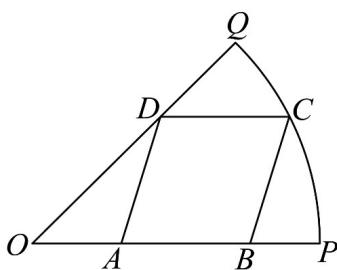
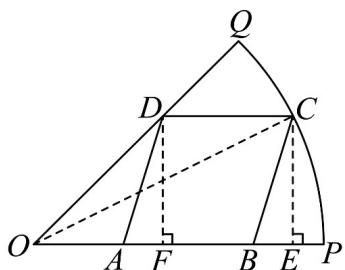
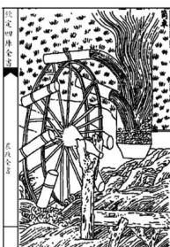
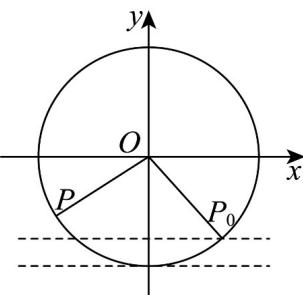

## 题型三：三角函数模型的实际应用

21. 为迎接大运会的到来，学校决定在半径为 $20\sqrt{2}\mathrm{m}$ ，圆心角为 $\frac{\pi}{4}$ 的扇形空地 $OPQ$ 的内部修建一平行四边形观赛场地 $ABCD$ ，如图所示，则观赛场地的面积最大值为 $\mathrm{m}^2$ .

【答案】 $400\left(\sqrt{2}-1\right)$

【详解】如图所示：

连接 OC，设 $\angle COA = \theta$ ，作 $DF \perp OP$ ， $CE \perp OP$ ，垂足分别为 F, E

根据平面几何知识可知， $AB = CD = EF$ ， $DF = OF$ ， $CE = DF$

所以 $CE = 20\sqrt{2}\sin \theta$ ， $EF = OE - OF = 20\sqrt{2}\cos \theta -20\sqrt{2}\sin \theta$

故四边形 ABCD 的面积 S 也为四边形 DFEC 的面积，

即有 $S = 20\sqrt{2}\sin \theta \times 20\sqrt{2} (\cos \theta -\sin \theta) = 400(\sin 2\theta +\cos 2\theta -1)$

$= 400\sqrt{2}\sin \left(2\theta +\frac{\pi}{4}\right) - 400$ ，其中 $\theta \in \left(0,\frac{\pi}{4}\right)$

所以当 $\sin\left(2\theta+\frac{\pi}{4}\right)=1$ 即 $\theta=\frac{\pi}{8}$ 时， $S_{\max}=400\left(\sqrt{2}-1\right)\mathrm{m}^{2}$

故答案为： $400\left(\sqrt{2}-1\right)$

22. 筒车是我国古代发明的一种水利灌溉工具，既经济又环保·明朝科学家徐光启在《农政全书》中用图画描绘了筒车的工作原理（图1）·假定在水流量稳定的情况下，筒车上的每一个盛水筒都做匀速圆周运动·如图2，将筒车抽象为一个半径为 $R$ 的圆，设筒车按逆时针方向每旋转一周用时 $^{120}$ 秒，当 $t = 0$ 时，盛水筒 $M$ 位于点 $P_0(2, -2\sqrt{3})$ ，经过 $t$ 秒后运动到点 $P(x, y)$ ，点 $P$ 的纵坐标满足

$y = f(t) = R \sin (\omega t + \varphi) \left( t \quad 0, \omega > 0, |\varphi| < \frac{\pi}{2} \right)$ ，则当筒车旋转 $^{90}$ 秒时，盛水筒 $M$ 对应的点 $P$ 的纵坐标为\_\_\_\_

图1

图2

【答案】-2

【详解】因为筒车按逆时针方向每旋转一周用时 $120$ 秒，所以 $T = \frac{2\pi}{\omega} = 120$ ，得 $\omega = \frac{\pi}{60}$ ，所以 $y = f(t) = R\sin \left(\frac{\pi}{60} t + \varphi\right).$

因为当 $t = 0$ 时，盛水筒 $M$ 位于点 $P_{0}(2, -2\sqrt{3})$ ，所以 $R = \sqrt{2^{2} + (-2\sqrt{3})^{2}} = 4$ ，所以 $f(t) = 4\sin \left(\frac{\pi}{60} t + \varphi\right)$ 因为 $f(0) = -2\sqrt{3}$ ，所以 $4\sin \varphi = -2\sqrt{3}$ ，得 $\sin \varphi = -\frac{\sqrt{3}}{2}$ 因为 $|\varphi| < \frac{\pi}{2}$ ，所以 $\varphi = -\frac{\pi}{3}$ ，所以 $f(t) = 4\sin \left(\frac{\pi}{60} t - \frac{\pi}{3}\right)$ 所以 $f(90) = 4\sin \left(\frac{\pi}{60} \times 90 - \frac{\pi}{3}\right) = 4\sin \left(\frac{3}{2}\pi - \frac{\pi}{3}\right) = -2.$

故答案为：-2

![[高中/课堂同步/题库/人教A版高中数学同步讲义(2026)/01_必修第一册/第五章 三角函数/专题06函数函数y＝Asin(ωx＋φ)及函数的应用的四大常考题型（高效培优专项训练）数学人教A版2019高一必修第一册/题型三_三角函数模型的实际应用/questions/Q00076224.md]]
![[高中/课堂同步/题库/人教A版高中数学同步讲义(2026)/01_必修第一册/第五章 三角函数/专题06函数函数y＝Asin(ωx＋φ)及函数的应用的四大常考题型（高效培优专项训练）数学人教A版2019高一必修第一册/题型三_三角函数模型的实际应用/questions/Q00076225.md]]
![[高中/课堂同步/题库/人教A版高中数学同步讲义(2026)/01_必修第一册/第五章 三角函数/专题06函数函数y＝Asin(ωx＋φ)及函数的应用的四大常考题型（高效培优专项训练）数学人教A版2019高一必修第一册/题型三_三角函数模型的实际应用/questions/Q00076226.md]]
![[高中/课堂同步/题库/人教A版高中数学同步讲义(2026)/01_必修第一册/第五章 三角函数/专题06函数函数y＝Asin(ωx＋φ)及函数的应用的四大常考题型（高效培优专项训练）数学人教A版2019高一必修第一册/题型三_三角函数模型的实际应用/questions/Q00076227.md]]
![[高中/课堂同步/题库/人教A版高中数学同步讲义(2026)/01_必修第一册/第五章 三角函数/专题06函数函数y＝Asin(ωx＋φ)及函数的应用的四大常考题型（高效培优专项训练）数学人教A版2019高一必修第一册/题型三_三角函数模型的实际应用/questions/Q00076228.md]]
