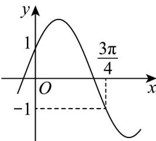

<!-- question-source:start -->
14. 已知函数 $f(x) = 2\sin (\omega x + \varphi)$ 的部分图像如图所示.

(1) 函数 $f(x)$ 的最小正周期为 \_\_\_\_.

(2) 将函数 $f(x)$ 的图象向右平移 $t(t > 0)$ 个单位长度，得到函数 $g(x)$ 的图象。若函数 $g(x)$ 为偶函数，则 $t$ 的最小值是 \_\_\_\_。
<!-- question-source:end -->

![[高中/课堂同步/题库/人教A版高中数学同步讲义(2026)/01_必修第一册/第五章 三角函数/专题06函数函数y＝Asin(ωx＋φ)及函数的应用的四大常考题型（高效培优专项训练）数学人教A版2019高一必修第一册/题型二_三角函数图象与性质的综合应用/questions/answers/Q00076217A1.md]]
