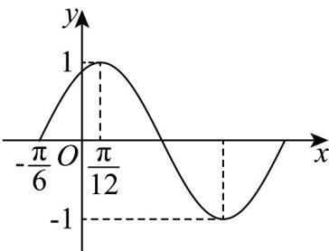

<!-- question-source:start -->
18. 已知函数 $f(x) = A\sin (\omega x + \varphi)\left(A > 0, \omega > 0, -\frac{\pi}{2} < \varphi < \frac{\pi}{2}\right)$ 在一个周期内的图象如图所示.

(1)求函数 $f(x)$ 的最小正周期T及 $f(x)$ 的解析式；

(2)求函数 $f(x)$ 的对称轴方程及单调递增区间；

(3)将 $f(x)$ 的图象向右平移 $\frac{\pi}{3}$ 个单位长度，再将所得图象上所有点的横坐标伸长为原来的 $^2$ 倍（纵坐标不变），得到函数 $g(x)$ 的图象，若 $g(x) = a - 1$ 在 $x \in \left[\frac{\pi}{2}, \frac{3\pi}{2}\right]$ 上有两个解，求 $a$ 的取值范围。
<!-- question-source:end -->

![[高中/课堂同步/题库/人教A版高中数学同步讲义(2026)/01_必修第一册/第五章 三角函数/专题06函数函数y＝Asin(ωx＋φ)及函数的应用的四大常考题型（高效培优专项训练）数学人教A版2019高一必修第一册/题型二_三角函数图象与性质的综合应用/questions/answers/Q00076221A1.md]]
