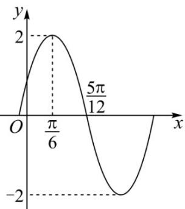

<!-- question-source:start -->
20. 已知函数 $f(x) = A \sin (\omega x + \varphi)$ （其中 $A > 0, \omega > 0, ^{0 < \varphi < \frac{\pi}{2}}$ ）的图像如图所示

(1)求函数 $f(x)$ 的解析式及其对称轴方程；

(2)将函数 $f(x)$ 的图像上各点的横坐标变为原来的 $\frac{2}{a}(a > 0)$ 倍，纵坐标不变，得到了函数 $y = g(x)$ 的图像，若函数 $g(x)$ 在 $\left[\frac{\pi}{8}, \frac{\pi}{4}\right]$ 上单调递增，求 $a$ 的取值范围.
<!-- question-source:end -->

![[高中/课堂同步/题库/人教A版高中数学同步讲义(2026)/01_必修第一册/第五章 三角函数/专题06函数函数y＝Asin(ωx＋φ)及函数的应用的四大常考题型（高效培优专项训练）数学人教A版2019高一必修第一册/题型二_三角函数图象与性质的综合应用/questions/answers/Q00076223A1.md]]
