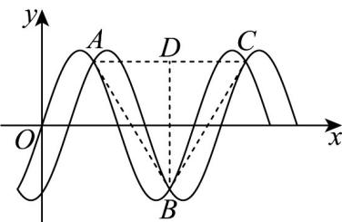

> [!faq]- 《专题06函数函数y＝Asin(ωx＋φ)及函数的应用的四大常考题型（高效培优专项训练）数学人教A版2019高一必修第一册》官方解析
>
> > [!success]- **【答案】** $\omega >\frac{\sqrt{3}}{3}$
>
> > [!note]- **【解析】**
> > 由题意可得 $g(x) = f\left(x - \frac{1}{3\omega}\right) = \sin \left[\pi \omega \left(x - \frac{1}{3\omega}\right)\right] = \sin \left(\pi \omega x - \frac{\pi}{3}\right)$
> >
> > 作出函数 $f(x)$ 、 $g(x)$ 的图象如下图所示：
> >
> > 
> >
> > 点 $A, B, C$ 是 $f(x)$ 与 $g(x)$ 图象的连续相邻的三个交点（不妨设 $B$ 在 $x$ 轴下方）， $D$ 为 $AC$ 的中点，由对称性可得 $\mathrm{V}ABC$ 是以 $B$ 为顶角的等腰三角形，所以 $\left|AC\right| = T = \frac{2\pi}{\omega\pi} = \frac{2}{\omega} = 2\left|CD\right|$ ，
> >
> > 由 $\sin \omega \pi x = \sin \left(\omega \pi x - \frac{\pi}{3}\right) = \frac{1}{2}\sin \omega \pi x - \frac{\sqrt{3}}{2}\cos \omega \pi x$
> >
> > 整理得 $\frac{1}{2}\sin \omega \pi x = -\frac{\sqrt{3}}{2}\cos \omega \pi x$ ，所以 $\tan \omega \pi x = -\sqrt{3}$
> >
> > 则 $\sin^2\pi \omega x = \frac{\sin^2\pi\omega x}{\cos^2\pi\omega x + \sin^2\pi\omega x} = \frac{\tan^2\pi\omega x}{1 + \tan^2\pi\omega x} = \frac{3}{4}$ ，所以， $\sin \omega \pi x = \pm \frac{\sqrt{3}}{2}$
> >
> > 则 $y_{A} = y_{C} = -y_{B} = \frac{\sqrt{3}}{2}$ ，所以 $\left|BD\right| = 2\left|y_A\right| = \sqrt{3}$
> >
> > 要使 $_{VABC}$ 为锐角三角形， $0 < \angle ABD < \frac{\pi}{4}$ ，所以， $\tan\angle ABD = \frac{|AD|}{|BD|} = \frac{1}{\sqrt{3}\omega} < 1$ ，
> >
> > $\because \omega > 0$ ，解得 $\omega > \frac{\sqrt{3}}{3}$ .
> >
> > 故答案为： $\omega > \frac{\sqrt{3}}{3}$
> >
> > 12. 先将 $y = \tan x$ 的图象上所有点的横坐标缩小为原来的 $\frac{1}{2}$ ，纵坐标不变，再将所得图象向左平移 $\frac{\pi}{12}$ 个单位长度后得到函数 $f(x)$ 的图象，若 $\alpha \in \left(-\frac{\pi}{3}, \frac{\pi}{3}\right)$ ，且 $f(\alpha) > -\sqrt{3}$ ，则 $\alpha$ 的取值范围是 \_\_\_\_。
> >
> > 【答案】 $\left(-\frac{\pi}{4},\frac{\pi}{6}\right)\cup \left(\frac{\pi}{4},\frac{\pi}{3}\right)$
> >
> > 【详解】将 $y = \tan x$ 的图象上所有点的横坐标缩小为原来的 $\frac{1}{2}$ ，纵坐标不变，
> >
> > 再将所得图象向左平移 $\frac{\pi}{12}$ 个单位长度后可得 $f(x) = \tan \left(2x + \frac{\pi}{6}\right)$ ，
> >
> > 由 $\alpha \in \left(-\frac{\pi}{3},\frac{\pi}{3}\right)$ ，则 $2\alpha +\frac{\pi}{6}\in \left(-\frac{\pi}{2},\frac{5\pi}{6}\right)$
> >
> > 因为 $f(\alpha) > -\sqrt{3}$ ，即 $\tan \left(2\alpha + \frac{\pi}{6}\right) > -\sqrt{3}$
> >
> > 故有 $-\frac{\pi}{3}<2\alpha+\frac{\pi}{6}<\frac{\pi}{2}$ 或 $\frac{2\pi}{3}<2\alpha+\frac{\pi}{6}<\frac{5\pi}{6}$ ，
> >
> > 解得 $\alpha \in \left(-\frac{\pi}{4},\frac{\pi}{6}\right)\cup \left(\frac{\pi}{4},\frac{\pi}{3}\right)$
> >
> > 故答案为： $\left(-\frac{\pi}{4},\frac{\pi}{6}\right)\cup \left(\frac{\pi}{4},\frac{\pi}{3}\right)$
> >
> > 13. 将函数 $y = \sin x$ 的图象向右平移 $\frac{\pi}{4}$ 个单位后，再将所得图象各点的横坐标缩小为原来的 $\frac{1}{2\omega} (\omega > 0)$ ，纵坐标不变，得到函数 $f(x)$ 的图象，若 $f(x)$ 在区间 $(\pi, 2\pi)$ 内没有零点，则 $\omega$ 的取值范围是 \_\_\_\_。
> >
> > 【答案】 $(0, \frac{1}{16}] \cup [\frac{1}{8}, \frac{5}{16}]$
> >
> > 【详解】由题意知， $f(x) = \sin (2\omega x - \frac{\pi}{4})(\omega >0)$
> >
> > 由 $\pi<x<2\pi$ ，得 $2\omega\pi-\frac{\pi}{4}<2\omega x-\frac{\pi}{4}<4\omega\pi-\frac{\pi}{4}$
> >
> > 若 $f(x)$ 在区间 $(\pi, 2\pi)$ 内没有零点，
> >
> > 则 $k\pi \leq 2\omega \pi - \frac{\pi}{4} < 4\omega \pi - \frac{\pi}{4} \leq \pi + k\pi, k \in \mathbf{Z}$ ，解得 $\frac{1}{8} + \frac{k}{2} \leq \omega \leq \frac{5}{16} + \frac{k}{4}, k \in \mathbf{Z}$
> >
> > 由 $\omega > 0$ ，当 $k = -1$ 时， $0 < \omega \leq \frac{1}{16}$ ，当 $k = 0$ 时， $\frac{1}{8} \leq \omega \leq \frac{5}{16}$ ，当 $k = 1$ 时，不符合，
> >
> > 所以 $\omega$ 的取值范围为 $(0,\frac{1}{16}]\cup[\frac{1}{8},\frac{5}{16}]$ .
> >
> > 故答案为： $(0,\frac{1}{16} ]\cup [\frac{1}{8},\frac{5}{16} ]$
