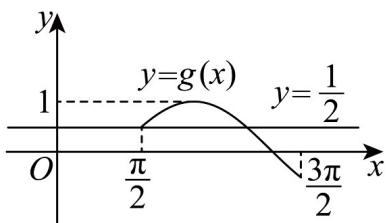

> [!faq]- 《专题06函数函数y＝Asin(ωx＋φ)及函数的应用的四大常考题型（高效培优专项训练）数学人教A版2019高一必修第一册》官方解析
>
> > [!success]- **【答案】** (1) $T=\pi$ ， $f(x)=\sin\left(2x+\frac{\pi}{3}\right)$ (2)对称轴为： $x=\frac{\pi}{12}+\frac{k\pi}{2}$ （ $k\in Z$ ），增区间为： $\left[-\frac{5}{12}\pi+k\pi,\frac{\pi}{12}+k\pi\right]$ （ $k\in Z$ ） $$ (3) \left[ \frac {3}{2}, 2\right) $$
>
> > [!note]- **【解析】**
> > （1）由题意 $A = 1$ ， $\frac{T}{4} = \frac{\pi}{12} +\frac{\pi}{6} = \frac{\pi}{4}\Rightarrow T = \pi$
> >
> > 则 $\frac{2\pi}{\omega} = \pi \Rightarrow \omega = 2$ ，所以 $f(x) = \sin (2x + \varphi)$
> >
> > 又因为图象过点 $\left(\frac{\pi}{12},1\right)$ ，所以 $2\times\frac{\pi}{12}+\varphi=\frac{\pi}{2}+2k\pi(k\in\mathbf{Z})$ ，可得 $\varphi=\frac{\pi}{3}+2k\pi(k\in\mathbf{Z})$ ；
> >
> > 而 $-\frac{\pi}{2} < \varphi < \frac{\pi}{2}$ ，则 $\varphi = \frac{\pi}{3}$ ，
> >
> > 于是 $f(x)=\sin\left(2x+\frac{\pi}{3}\right)$ .
> >
> > (2) 结合图象可知，函数的对称轴为 $x = \frac{\pi}{12} + \frac{k\pi}{2}$ （ $k \in Z$ ），
> >
> > 令 $-\frac{\pi}{2} + 2k\pi \leq 2x + \frac{\pi}{3} \leq \frac{\pi}{2} + 2k\pi$ ， $k \in \mathbf{Z}$ ，解得 $-\frac{5}{12}\pi + k\pi \leq x \leq \frac{\pi}{12} + k\pi$ ， $k \in \mathbf{Z}$ ，
> >
> > 即函数的增区间为 $\left[-\frac{5}{12}\pi + k\pi, \frac{\pi}{12} + k\pi\right]$ （ $k \in \mathbf{Z}$ ）.
> >
> > (3) $f(x)$ 的图象向右平移 $\frac{\pi}{3}$ 个单位长度得到： $y = \sin \left[2\left(x - \frac{\pi}{3}\right) + \frac{\pi}{3}\right] = \sin \left(2x - \frac{\pi}{3}\right)$ ，于是 $g(x) = \sin \left(x - \frac{\pi}{3}\right)$ ，如图所示：
> >
> > 
> >
> > 因为 $g(x) = a - 1$ 在 $x \in \left[\frac{\pi}{2}, \frac{3\pi}{2}\right]$ 上有两个解，所以 $\frac{1}{2} \leq a - 1 < 1$ ，即 $\frac{3}{2} \leq a < 2$ ；
> >
> > 即 a 的取值范围为 $a \in \left[\frac{3}{2}, 2\right)$ .
