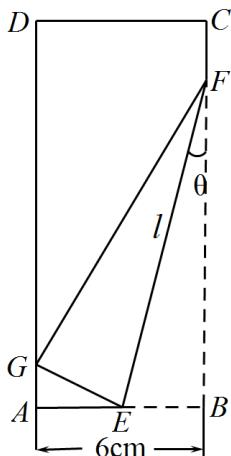

<!-- question-source:start -->
33. 如图，将矩形纸片 $ABCD$ 的右下角折起，使得该角的顶点落在矩形的边 $AD$ 上，记为 $G$ ，若 $\sin \theta = \frac{1}{4}$ ，则折痕 $l$ 的长度为 \_\_\_\_ cm.

<!-- question-source:end -->

![[高中/课堂同步/题库/人教A版高中数学同步讲义(2026)/01_必修第一册/第五章 三角函数/专题06函数函数y＝Asin(ωx＋φ)及函数的应用的四大常考题型（高效培优专项训练）数学人教A版2019高一必修第一册/题型四_几何中的三角函数模型/questions/answers/Q00076231A1.md]]
