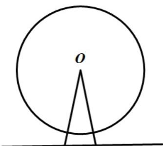

<!-- question-source:start -->
37. 如图，游乐场所的摩天轮匀速旋转，每转一周需要 $12 \mathrm{~min}$ ，其中心 $O$ 离地面 $45$ 米，半径 $40$ 米·如果你从最低处登上摩天轮，那么你与地面的距离将随时间的变化而变化，以你登上摩天轮的时刻开始计时，请问：当你第六次距离地面 $65$ 米时，用了\_\_\_\_分钟？

<!-- question-source:end -->

![[高中/课堂同步/题库/人教A版高中数学同步讲义(2026)/01_必修第一册/第五章 三角函数/专题06函数函数y＝Asin(ωx＋φ)及函数的应用的四大常考题型（高效培优专项训练）数学人教A版2019高一必修第一册/题型四_几何中的三角函数模型/questions/answers/Q00076234A1.md]]
