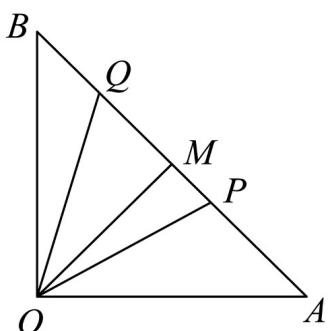

<!-- question-source:start -->
40. 如图所示，在等腰直角 $\triangle OAB$ 中， $\angle AOB = \frac{\pi}{2}, OA = \sqrt{2}, M$ 为线段 $AB$ 的中点，点 $P, Q$ 分别在线段 $AM, BM$ 上运动，且 $\angle POQ = \frac{\pi}{4}$ ，设 $\angle AOP = \theta$ .

(1)设 $PM = f(\theta)$ ，求 $\theta$ 的取值范围及 $f(\theta)$ ;

(2)求 $^{\triangle}$ OPQ 面积的最小值.
<!-- question-source:end -->

![[高中/课堂同步/题库/人教A版高中数学同步讲义(2026)/01_必修第一册/第五章 三角函数/专题06函数函数y＝Asin(ωx＋φ)及函数的应用的四大常考题型（高效培优专项训练）数学人教A版2019高一必修第一册/题型四_几何中的三角函数模型/questions/answers/Q00076235A1.md]]
