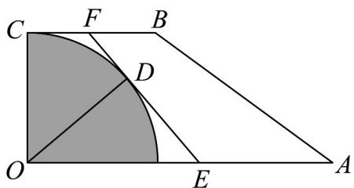
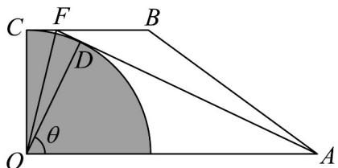
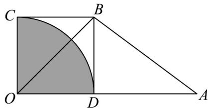

> [!faq]- 《专题06函数函数y＝Asin(ωx＋φ)及函数的应用的四大常考题型（高效培优专项训练）数学人教A版2019高一必修第一册》官方解析
>
> > [!success]- **【答案】** 
>
> > [!note]- **【解析】**
> > 如图，当 $E, A$ 重合时， $\theta$ 最大，此时 $\theta = \frac{\pi}{3}$ ，而当 $F, B$ 重合时， $\theta$ 最小，此时 $\theta = 0$
> >
> > 
> >
> > 
> >
> > 所以 $0 \leq \theta \leq \frac{\pi}{3}$ ，则 $\angle DOF = \frac{\pi}{4} - \frac{\theta}{2}$
> >
> > 在 $\mathrm{Rt}\triangle DOE$ 中， $DE = OD\tan \theta = \tan \theta$
> >
> > 在中， $DF = \tan \left(\frac{\pi}{4} -\frac{\theta}{2}\right) = \frac{\sin\left(\frac{\pi}{4} - \frac{\theta}{2}\right)}{\cos\left(\frac{\pi}{4} - \frac{\theta}{2}\right)} = \frac{\cos\frac{\theta}{2} - \sin\frac{\theta}{2}}{\cos\frac{\theta}{2} + \sin\frac{\theta}{2}}$ Rt△DOF
> >
> > $$
> > = \frac {\left(\cos \frac {\theta}{2} - \sin \frac {\theta}{2}\right) ^ {2}}{\left(\cos \frac {\theta}{2} + \sin \frac {\theta}{2}\right) \left(\cos \frac {\theta}{2} - \sin \frac {\theta}{2}\right)} = \frac {1 - \sin \theta}{\cos \theta},
> > $$
> >
> > $\therefore EF = DE + DF = \tan \theta + \frac{1 - \sin \theta}{\cos \theta} = \frac{1}{\cos \theta}$
> >
> > 即道路 $EF$ 的长度 $y$ 与 $\theta$ 的函数关系为 $y = \frac{1}{\cos\theta}\left(0\leq \theta \leq \frac{\pi}{3}\right)$
> >
> > 故答案为： $y=\frac{1}{\cos\theta}\left(0\leq\theta\leq\frac{\pi}{3}\right)$
