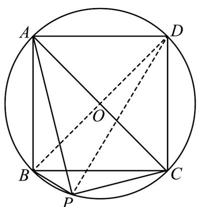

> [!faq]- 《专题06函数函数y＝Asin(ωx＋φ)及函数的应用的四大常考题型（高效培优专项训练）数学人教A版2019高一必修第一册》官方解析
>
> > [!success]- **【答案】** $2 \sqrt{3}$
>
> > [!note]- **【解析】**
> > 如图．连接 $_{BD,DP}$ ，设 $\angle PAC=\theta,\theta\in\left[0,\frac{\pi}{4}\right]$ ，则 $\angle BDP=\angle BAP=\frac{\pi}{4}-\theta$
> >
> > 在 $Rt\triangle APC$ 中， $PA = AC\cos \theta = 2\cos \theta, PC = AC\sin \theta = 2\sin \theta$ ，在 $Rt\triangle BDP$ 中，
> >
> > $$
> > P B = B D \sin \left(\frac {\pi}{4} - \theta\right) = 2 \sin \left(\frac {\pi}{4} - \theta\right)
> > $$
> >
> > 所以
> >
> > $|PA|+|PB|+|PC|=2\left[\cos\theta+\sin\left(\frac{\pi}{4}-\theta\right)+\sin\theta\right]=(2+\sqrt{2})\cos\theta+(2-\sqrt{2})\sin\theta=2\sqrt{3}\sin(\theta+\varphi)$ ，其中 $\tan\varphi=3+2\sqrt{2},\varphi\in\left(\frac{\pi}{4},\frac{\pi}{2}\right)$
> >
> > 所以 $(|PA| + |PB| + |PC|)_{\max} = 2\sqrt{3}$ ，由 $\theta$ 的范围可以取到最大值。
> >
> > 故答案为： $2 \sqrt{3}$
> >
> > 
