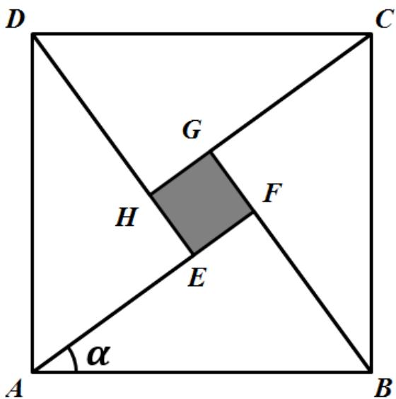

> [!faq]- 《专题06函数函数y＝Asin(ωx＋φ)及函数的应用的四大常考题型（高效培优专项训练）数学人教A版2019高一必修第一册》官方解析
>
> > [!success]- **【答案】** $1+\frac{\sqrt{5}}{2}$
>
> > [!note]- **【解析】**
> > 解：由题可知，设 $P(\cos \theta, \sin \theta)$ ，则 $Q(-\sin \theta, \cos \theta)$
> >
> > 因为 $A(2,0)$ ，所以线段 $_{AP}$ 的中点 M 得坐标为 $\left(\frac{2+\cos\theta}{2},\frac{\sin\theta}{2}\right)$ ，
> >
> > 所以 $\left|MQ\right|=\sqrt{\left(\frac{2+\cos\theta}{2}+\sin\theta\right)^{2}+\left(\frac{\sin\theta}{2}-\cos\theta\right)^{2}}$ $=\sqrt{\frac{\left(\cos\theta+2\right)^{2}+4\sin\theta\left(\cos\theta+2\right)+4\sin^{2}\theta+\sin^{2}\theta-4\sin\theta\cos\theta+4\cos^{2}\theta}{4}}$ $=\frac{\sqrt{9+4\cos\theta+8\sin\theta}}{2}$ $=\frac{\sqrt{9+4\sqrt{5}\sin\left(\theta+\varphi\right)}}{2}$ ，其中 $\tan\varphi=\frac{1}{2}$ ，
> >
> > 因为 $\sin(\theta+\varphi)\in[-1,1]$
> >
> > 所以当 $\sin (\theta +\varphi) = 1$ 时， $|MQ|$ 取最大值为 $1 + \frac{\sqrt{5}}{2}$
> >
> > 故答案为： $1+\frac{\sqrt{5}}{2}$
> >
> > 35. 我国古代数学家赵爽利用“勾股圆方图”巧妙地证明了勾股定理，成就了我国古代数学的骄傲，后人称之为“赵爽弦图”。如图，它是由四个全等的直角三角形和中间的一个小正方形 $EFGH$ 拼成的一个大正方形 $ABCD$ ，若直角三角形中 $AF = a$ ， $BF = b$ ，较小的锐角 $\angle FAB = \alpha$ 。若 $(a + b)^2 = 196$ ，正方形 $ABCD$ 的面积为 $100$ ，则 $\cos 2\alpha =$ \_\_\_\_， $\sin \frac{\alpha}{2} - \cos \frac{\alpha}{2} =$ \_\_\_\_。
> >
> > 【答案】
> >
> > 
> >
> > 【答案】 $\frac{7}{25} -\frac{\sqrt{10}}{5}$
> >
> > 【详解】由已知得 $a^2 + b^2 = 100$ ， $(a + b)^2 = 196$ ，又 $a > b$
> >
> > 解得 $a = 8$ ， $b = 6$ ，所以 $\cos \alpha = \frac{8}{10} = \frac{4}{5}$ ， $\sin \alpha = \frac{6}{10} = \frac{3}{5}$
> >
> > $$
> > \cos 2 \alpha = 2 \cos^ {2} \alpha - 1 = 2 \times \left(\frac {4}{5}\right) ^ {2} - 1 = \frac {7}{2 5}
> > $$
> >
> > 因为 $0 < \alpha < \frac{\pi}{2}$ ，所以 $0 < \frac{\alpha}{2} < \frac{\pi}{4}$ ，所以 $\cos \frac{\alpha}{2} > \sin \frac{\alpha}{2}$ ，
> >
> > $$
> > \sin \frac {\alpha}{2} - \cos \frac {\alpha}{2} = - \sqrt {\left(\sin \frac {\alpha}{2} - \cos \frac {\alpha}{2}\right) ^ {2}} = - \sqrt {1 - 2 \sin \frac {\alpha}{2} \cos \frac {\alpha}{2}}
> > $$
> >
> > $$
> > = - \sqrt {1 - \sin \alpha} = - \sqrt {1 - \frac {3}{5}} = - \frac {\sqrt {1 0}}{5}
> > $$
> >
> > 故答案为：① $\frac{7}{25}$ ；
> > - **②**：$-\frac{\sqrt{10}}{5}$
