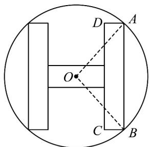
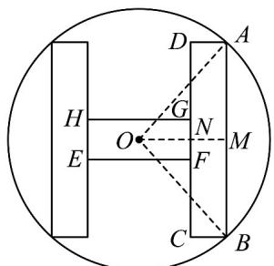

> [!faq]- 《专题06函数函数y＝Asin(ωx＋φ)及函数的应用的四大常考题型（高效培优专项训练）数学人教A版2019高一必修第一册》官方解析
>
> > [!success]- **【答案】**  $$ 2 8 \sin \alpha + 6 \cos \alpha $$ $$ \sqrt {1 3} - 1 6 $$
>
> > [!note]- **【解析】**
> > 过 $O$ 作 $OM \perp AB$ ，垂足为 $M$ ， $OM$ 交 $CD$ 于 $N$ ，则 $M, N$ 分别为 $AB, CD$ 中点设 $EFGH$ 为横向矩形，如图所示：
> >
> > 
> >
> > 因为 $AB = 2AM = 6\sin \alpha$ ， $AB = \frac{3}{2} EF$ ，所以 $EF = \frac{2}{3} AB = 4\sin \alpha$
> >
> > 所以 AD = MN = OM - ON = OM - $\frac{1}{2}EF = 3\cos\alpha - 2\sin\alpha$ .
> >
> > “H”型图形周长为：
> >
> > $$
> > C = 4 \times 6 \sin \alpha + 2 \times (3 \cos \alpha - 2 \sin \alpha) + 2 \times 4 \sin \alpha = 2 8 \sin \alpha + 6 \cos \alpha .
> > $$
> >
> > “H”型图形面积为：
> >
> > $$
> > S = 2 S _ {A B C D} + S _ {E F G H} = 2 S _ {A B C D} + \frac {2}{3} S _ {A B C D} = \frac {8}{3} S _ {A B C D}
> > $$
> >
> > $$
> > = \frac {8}{3} \times 6 \sin \alpha \times (3 \cos \alpha - 2 \sin \alpha) = 4 8 \sin \alpha \cos \alpha - 3 2 \sin^ {2} \alpha
> > $$
> >
> > $$
> > = 2 4 \sin 2 \alpha - 3 2 \times \frac {1 - \cos 2 \alpha}{2} = 2 4 \sin 2 \alpha + 1 6 \cos 2 \alpha - 1 6 = 8 \sqrt {1 3} \sin (2 \alpha + \varphi) - 1 6
> > $$
> >
> > 其中 $\tan\varphi=\frac{2}{3}$ .
> >
> > 当 $\sin(2\alpha+\varphi)=1$ 时，S 取得最大值为 $8\sqrt{13}-16$
> >
> > 故答案为： $28\sin\alpha+6\cos\alpha$ ; $8\sqrt{13}-16$
