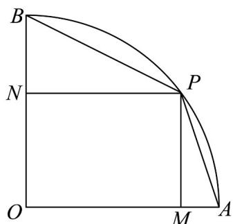
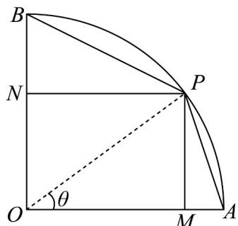
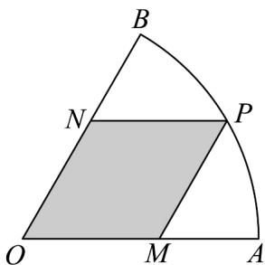
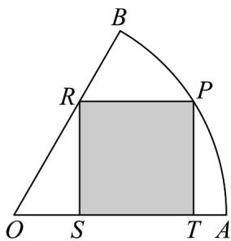
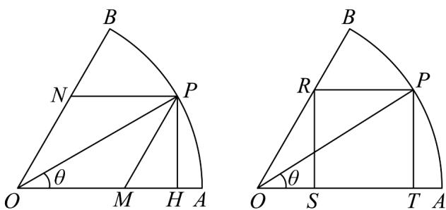

> [!faq]- 《专题06函数函数y＝Asin(ωx＋φ)及函数的应用的四大常考题型（高效培优专项训练）数学人教A版2019高一必修第一册》官方解析
>
> > [!success]- **【答案】** 32.
>
> > [!note]- **【解析】**
> > 设时间为 $t$ ， $t > 0$ ，根据题意： $40\sin \left(\frac{\pi}{6} t - \frac{\pi}{2}\right) + 45 = 65$ ，故 $\sin \left(\frac{\pi}{6} t - \frac{\pi}{2}\right) = \frac{1}{2}$
> >
> > 故 $\frac{\pi}{6} t - \frac{\pi}{2} = \frac{\pi}{6} + 2k\pi$ 或 $\frac{\pi}{6} t - \frac{\pi}{2} = \frac{5\pi}{6} + 2k\pi$ ，故 $t = 12k + 4$ 或 $t = 12k + 8$ ， $k \in \mathbb{Z}$ .
> >
> > 故 $t_1 = 4, t_2 = 8, t_3 = 16, t_4 = 20, t_5 = 28, t_6 = 32$
> >
> > 故答案为：32·
> >
> > 38. 校园里有个如图的半径为 $^{4}$ ，圆心角为 $\frac{\pi}{2}$ 的扇形花坛 $AOB$ ， $P$ 是圆弧 $AB$ 上一点（不包括 $A, B$ ），点 $M, N$ 分别在半径 $OA, OB$ 上·为美化校园，分别在四边形 $PMON, \triangle PBN$ 和 $\triangle PMA$ 种植红色，黄色的牡丹花，其余地方种植绿草点缀·
> >
> > 
> >
> > (1)若种植红色牡丹的四边形 PMON 为矩形，求其面积最大值；
> >
> > (2)若种植黄色牡丹的 $\triangle PBN$ 和 $\triangle PMA$ 均为直角三角形，求它们面积之和的取值范围·
> >
> > 【答案】(1)8
> >
> > (2) $\left[8\sqrt{2} - 8, 8\right)$
> >
> > 【详解】（1）连接 $OP$ ，如图，令 $\angle AOP = \theta \left(0 < \theta < \frac{\pi}{2}\right)$
> >
> > 
> >
> > 因四边形 PMON 为矩形，
> >
> > 则 $OM = OP \cdot \cos \theta = 4\cos \theta$ ， $PM = OP \cdot \sin \theta = 4\sin \theta$
> >
> > 可得矩形 $PMON$ 的面积 $S_{PMON} = OM \cdot PM = 4\cos \theta \cdot 4\sin \theta = 8\sin 2\theta$
> >
> > 且 $0 < 2\theta < \pi$ ，则当 $2\theta = \frac{\pi}{2}$ ，即 $\theta = \frac{\pi}{4}$ 时， $\sin 2\theta$ 取最大值1，
> >
> > 所以 $S_{PMON}$ 的最大值为 8，
> >
> > 所以矩形 PMON 面积最大值为 8；
> >
> > (2) 由 (1) 知， $PN = OM = 4\cos \theta$ ， $ON = PM = 4\sin \theta$
> >
> > 则 $BN = 4 - 4\sin \theta$ ， $AM = 4 - 4\cos \theta$
> >
> > 所以 $Rt\triangle PBN$ 和 $Rt\triangle PMA$ 的面积和：
> >
> > $$
> > S = S _ {\triangle P B N} + S _ {\triangle P M A} = \frac {1}{2} P N \cdot B N + \frac {1}{2} P M \cdot A M
> > $$
> >
> > $$
> > = \frac {1}{2} \times 4 \cos \theta (4 - 4 \sin \theta) + \frac {1}{2} \times 4 \sin \theta \times (4 - 4 \cos \theta) = 8 (\sin \theta + \cos \theta) - 1 6 \sin \theta \cos \theta
> > $$
> >
> > 令 $\sin \theta +\cos \theta = t$
> >
> > 即 $t = \sqrt{2}\sin \left(\theta +\frac{\pi}{4}\right)$ ， $\frac{\pi}{4} <  \theta +\frac{\pi}{4} <   \frac{3\pi}{4}$ ，则 $1 <   t\leq \sqrt{2}$
> >
> > 且 $2\sin \theta \cos \theta = (\sin \theta + \cos \theta)^{2} - (\sin^{2}\theta + \cos^{2}\theta) = t^{2} - 1$
> >
> > 则 $S = f(t) = 8t - 8t^2 + 8 = -8\left(t - \frac{1}{2}\right)^2 + 10$
> >
> > 显然 $f(t)$ 在 $(1,\sqrt{2}]$ 上单调递减，
> >
> > 当 $t = \sqrt{2}$ ，即 $\theta = \frac{\pi}{4}$ 时， $f(x)_{\min} = f(\sqrt{2}) = 8\sqrt{2} - 8$
> >
> > 且 $f(1) = 8$ ，因此 $8\sqrt{2} - 8 \leq S < 8$
> >
> > 所以 Rt△PBN 和 Rt△ PMA 的面积和的取值范围是 $\left[8\sqrt{2}-8,8\right)$ .
> >
> > 39．2023年12月1日，“民族魂中国梦——阳光下成长”2023年浙江省中小学生艺术节闭幕式暨颁奖晚会在湖州大剧院举行．为迎接艺术节闭幕式的到来，承办方计划将场地内一处扇形荒地进行改造．已知该扇形荒地OAB的半径为20米，圆心角 $\angle AOB=\frac{\pi}{3}$ ，承办方初步计划将其中的OMPN（如下左图，点P位于弧AB上，M，N分别位于半径OA，OB）区域改造为花卉区，扇形荒地OAB内其余区域改造为草坪区．
> >
> > 
> >
> > 
> >
> > (1)承办方进一步计划将 $MP$ ， $NP$ 设计为观光步道，其宽度忽略不计．若观光步道造价为 $1000\sqrt{3}$ 元/米，请你设计观光步道的造价预算，确保观光步道最长时仍有资金保障；
> >
> > (2)因某种原因，承办方修改了最初的改造计划，将花卉区设计为矩形 $PRST$ （如下右图，其中S，T位于半径 $OA$ 上，R位于半径 $OB$ 上）。为美观起见，承办方最后决定将四边形 $PRST$ 设计为正方形。求此时花卉区 $PRST$ 的面积。
> >
> > 【答案】(1)40000 元
> >
> > (2) $\frac{8400-2400\sqrt{3}}{37}\left(m^{2}\right)$
> >
> > 【详解】（1）解：设 $\angle AOP = \theta$ ， $\theta \in \left(0, \frac{\pi}{3}\right)$ ，过点 P 做 OA 的垂线交 OA 于 H，
> >
> > 则 $PH = 20\sin \theta$ ， $OH = 20\cos \theta$ ， $MH = \frac{20}{3}\sqrt{3}\sin \theta$
> >
> > 所以 $MP=\frac{40}{3}\sqrt{3}\sin\theta$ ， $NP=20\cos\theta-\frac{20}{3}\sqrt{3}\sin\theta$
> >
> > $$
> > M P + N P = 2 0 \cos \theta + \frac {2 0}{3} \sqrt {3} \sin \theta = \frac {4 0}{3} \sqrt {3} \sin \left(\theta + \frac {\pi}{3}\right) \in \left(2 0, \frac {4 0}{3} \sqrt {3} \right]
> > $$
> >
> > 所以预算应该设定为 $\frac{40}{3}\sqrt{3} \times 1000\sqrt{3} = 40000$ 元.
> >
> > (2) 解：由题意得 $PT = 20 \sin \theta$ ， $ST = 20 \cos \theta - \frac{20}{3} \sqrt{3} \sin \theta$ ，
> >
> > 因为 $PT = ST$ ，可得 $20\sin \theta = 20\cos \theta -\frac{20}{3}\sqrt{3}\sin \theta$
> >
> > 则 $\tan \theta = \frac{3 - \sqrt{3}}{2}$ ，所以 $\sin \theta = \frac{3 - \sqrt{3}}{\sqrt{16 - 6\sqrt{3}}}$
> >
> > 所以 $S = PT^{2} = 400 \sin^{2} \theta = \frac{8400 - 2400\sqrt{3}}{37} (\mathrm{m}^{2})$ .
> >
> > 
