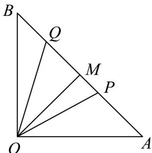

> [!faq]- 《专题06函数函数y＝Asin(ωx＋φ)及函数的应用的四大常考题型（高效培优专项训练）数学人教A版2019高一必修第一册》官方解析
>
> > [!success]- **【答案】** (1) $f(\theta)=\tan\left(\frac{\pi}{4}-\theta\right),\theta\in\left[0,\frac{\pi}{4}\right]$ (2) $\sqrt{2} - 1$
>
> > [!note]- **【解析】**
> > （1）因为 $\triangle OAB$ 为等腰直角三角形， $OA = \sqrt{2}, M$ 为线段 $AB$ 的中点，
> >
> > 所以 $OM = 1, \angle AOM = \frac{\pi}{4}, OM \perp AB$ .
> >
> > 因为点 $P$ 在线段 $AM$ 上运动，所以 $\theta \in \left[0, \frac{\pi}{4}\right]$
> >
> > 因为 $\angle AOP = \theta$ ，所以 $\angle POM = \frac{\pi}{4} -\theta ,PM = OM\cdot \tan \angle POM = \tan \left(\frac{\pi}{4} -\theta\right)$
> >
> > 所以 $f(\theta)=\tan\left(\frac{\pi}{4}-\theta\right),\theta\in\left[0,\frac{\pi}{4}\right]$ .
> >
> > (2) 因为 $\angle POQ = \angle MOA = \frac{\pi}{4}$ ，所以 $\angle QOM = \theta, QM = OM \cdot \tan \angle QOM = \tan \theta$ ，
> >
> > 所以 $PQ = PM + QM = \tan\left(\frac{\pi}{4} - \theta\right) + \tan\theta$
> >
> > $$
> > S _ {\triangle O P Q} = \frac {1}{2} P Q \cdot O M = \frac {1}{2} \left[ \tan \left(\frac {\pi}{4} - \theta\right) + \tan \theta \right] = \frac {1}{2} \left(\frac {1 - \tan \theta}{1 + \tan \theta} + \tan \theta\right)
> > $$
> >
> > $$
> > = \frac {1}{2} \left(\frac {2}{1 + \tan \theta} + \tan \theta - 1\right) = \frac {1}{2} \left(\frac {2}{1 + \tan \theta} + 1 + \tan \theta - 2\right) \quad \frac {1}{2} (2 \sqrt {2} - 2) = \sqrt {2} - 1
> > $$
> >
> > 当且仅当 $\tan \theta = \sqrt{2} - 1 \in [0,1]$ 时，等号成立，
> >
> > 所以 $\triangle OPQ$ 面积的最小值为 $\sqrt{2} - 1$ .
> >
> > 
