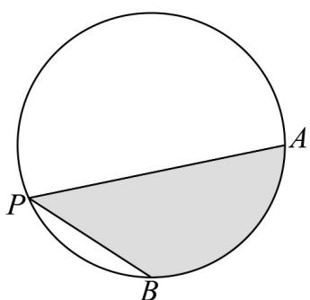

<!-- question-source:start -->
16．如图， $A,B$ 是半径为2的圆周上的定点， $P$ 为圆周上的动点， $\angle APB = \frac{\pi}{4}$ ·图中阴影区域的面积的最大值

为\_\_\_\_。

<!-- question-source:end -->

![[高中/课堂同步/题库/人教A版高中数学同步讲义(2026)/01_必修第一册/第五章 三角函数/专题5.1 任意角和弧度制（高效培优讲义）数学人教A版2019高一必修第一册/强化训练/questions/answers/Q00076652A1.md]]
