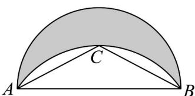

> [!faq]- 《专题5.1 任意角和弧度制（高效培优讲义）数学人教A版2019高一必修第一册》官方解析
>
> > [!success]- **【答案】** 以 $AB$ 为直径的圆的一部分圆弧，已知 $\angle ACB = \frac{2\pi}{3}$ ， $AC = BC = 1$ ，则该月牙形即阴影部分面积为（）  A. $\frac{\sqrt{3}}{4} +\frac{\pi}{24}$ B. $\frac{\sqrt{3}}{4} -\frac{\pi}{24}$ C. $\frac{1}{4} +\frac{\pi}{24}$ D. $\frac{3\sqrt{3}}{4} -\frac{\pi}{8}$
>
> > [!note]- **【解析】**
> > 本题未单列解析。
