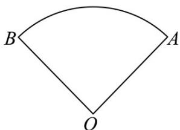

> [!faq]- 《专题5.1 任意角和弧度制（高效培优讲义）数学人教A版2019高一必修第一册》官方解析
>
> > [!success]- **【答案】**  ① $\angle AOB = 60^{\circ}$ ② $\square_{AB}$ 的长等于 $\frac{2\pi}{3}$ ; ③扇形 $OAB$ 的周长为 $\frac{2\pi}{3} + 4$ ； ④扇形 OAB 的面积为 $\frac{2\pi}{3}$ . A. 1个 B. 2个 C. 3个 D. 4个
>
> > [!note]- **【解析】**
> > - **对于①**：，因为 $\angle AOB = \frac{\pi}{3}$ ，根据角度制与弧度制的互化，可得 $\angle AOB = 60^{\circ}$ ，所以①正确；
> > - **对于②**：，由扇形的弧长公式，可得 $\square_{AB}$ 的长度为 $\frac{\pi}{3} \times 2 = \frac{2\pi}{3}$ ，所以②正确。
> > - **对于③**：，所以扇形的周长为 $l = \frac{2\pi}{3} + 2 + 2 = \frac{2\pi}{3} + 4$ ，所以③正确；
> > - **对于④**：，由扇形的面积公式，可得扇形的面积为 $S = \frac{1}{2} \times \frac{\pi}{3} \times 2^{2} = \frac{2\pi}{3}$ ，所以④正确。
> >
> > 故选 **D**.
