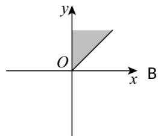
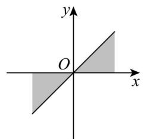
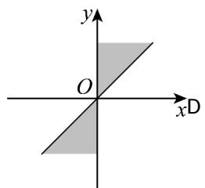
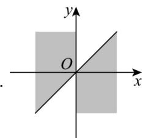

<!-- question-source:start -->
【典例1】集合 $\{\alpha \mid k\pi +\frac{\pi}{4}\leq \alpha \leq k\pi +\frac{\pi}{2},k\in \mathbf{Z}\}$ 中角表示的范围（用阴影表示）是图中的（

<!-- question-source:end -->

![[高中/课堂同步/题库/人教A版高中数学同步讲义(2026)/01_必修第一册/第五章 三角函数/专题5.1 任意角和弧度制（高效培优讲义）数学人教A版2019高一必修第一册/题型04_区域角的表示/questions/answers/Q00076625A1.md]]
