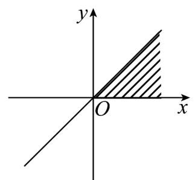
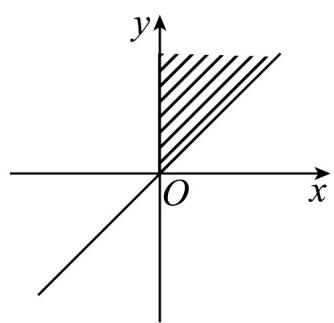
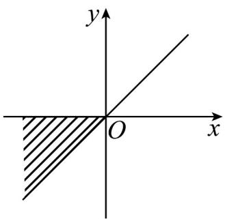
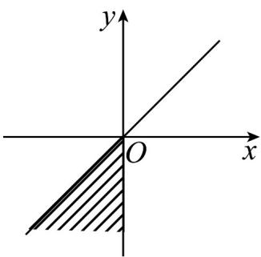

<!-- question-source:start -->
【变式3】已知集合 $\left\{\alpha \mid 2k\pi +\frac{\pi}{4}\leq \alpha \leq 2k\pi +\frac{\pi}{2},k\in Z\right\}$ 则角 $\alpha$ 的终边落在阴影处(包括边界)的区域是（

)

A

B

C.

D

<!-- question-source:end -->

![[高中/课堂同步/题库/人教A版高中数学同步讲义(2026)/01_必修第一册/第五章 三角函数/专题5.1 任意角和弧度制（高效培优讲义）数学人教A版2019高一必修第一册/题型04_区域角的表示/questions/answers/Q00076628A1.md]]
