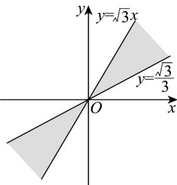

> [!faq]- 《专题5.1 任意角和弧度制（高效培优讲义）数学人教A版2019高一必修第一册》官方解析
>
> > [!success]- **【答案】**  A. $\left\{\alpha \left| \frac{\pi}{6} + 2k\pi < \alpha < \frac{\pi}{3} + 2k\pi, k \in \mathbb{Z} \right.\right\}$ B. $\left\{\alpha \left|\frac{\pi}{6} +\frac{k\pi}{2} < \alpha < \frac{\pi}{3} +\frac{k\pi}{2},k\in \mathbb{Z}\right.\right\}$ C. $\left\{\alpha \mid \frac{\pi}{6} + k\pi < \alpha < \frac{\pi}{3} + k\pi, k \in \mathbb{Z}\right\}$ D. $\left\{\alpha \left|\frac{\pi}{6} + \frac{3k\pi}{2} \leq \alpha \leq \frac{\pi}{3} + \frac{3k\pi}{2}, k \in \mathbb{Z}\right.\right\}$
>
> > [!note]- **【解析】**
> > 终边落在 $y = \frac{\sqrt{3}}{3} x$ 上的角为 $\frac{\pi}{6} + k\pi (k \in \mathbb{Z})$ ，终边落在 $y = \sqrt{3} x$ 上的角为 $\frac{\pi}{3} + k\pi (k \in \mathbb{Z})$
> >
> > 故角 $\alpha$ 的集合为 $\left\{\alpha \mid \frac{\pi}{6} + k\pi < \alpha < \frac{\pi}{3} + k\pi, k \in \mathbb{Z}\right\}$ .
> >
> > 故选 **C**
