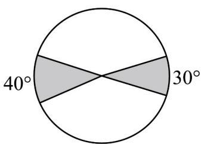

<!-- question-source:start -->
【典例1】如图，圆的半径为 $^{5}$ ，圆内阴影部分的面积是（）

A. $\frac{175\pi}{36}$ B. $\frac{125\pi}{18}$ C. $\frac{25\pi}{6}$ D. $\frac{34\pi}{9}$
<!-- question-source:end -->

![[高中/课堂同步/题库/人教A版高中数学同步讲义(2026)/01_必修第一册/第五章 三角函数/专题5.1 任意角和弧度制（高效培优讲义）数学人教A版2019高一必修第一册/题型05_弧度制与角度制的互化/questions/answers/Q00076629A1.md]]
